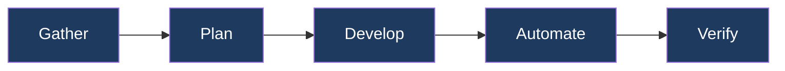
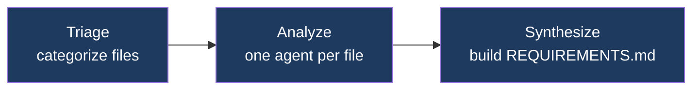
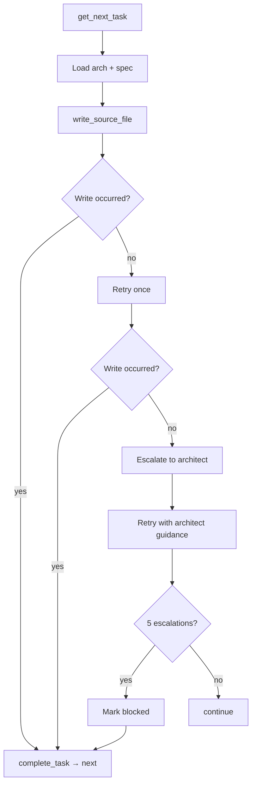

# Project VoidRift

**Local-first Agentic Development Framework**

A local-first AI development lifecycle tool. Five phases — Gather → Plan → Develop → Automate → Verify — produce a deployable, tested project from requirements alone. Any model can fill any role: local vLLM, cloud API, or gateway.



See [ARCHITECTURE.md](ARCHITECTURE.md) for component design, data flows, and key decisions.

---

## Contents

1. [Installation](#installation)
2. [Configuration](#configuration)
3. [Models](#models)
4. [Phases](#phases)
5. [Utility Commands](#utility-commands)
6. [Worker Node](#worker-node)
7. [Kiro Gateway](#kiro-gateway)
8. [Project Layout](#project-layout)
9. [Tried Local Models](#tried-local-models)
10. [Development](#development)

---

## Installation

**Workstation requirements:** Linux, macOS, or WSL2 · Git · SSH client (for local models)

```bash
git clone <repo-url> ~/Projects/voidrift
cd ~/Projects/voidrift
make setup        # installs packages and syncs resources to ~/.voidrift/
```

Verify:

```bash
voidrift          # opens interactive mode if no args
worker check      # verifies SSH, Docker, GPU, uvx on worker node
```

---

## Configuration

All settings in `~/.voidrift/config.yml`:

```yaml
worker:
  user: your-username
  ip: 192.168.x.x
  api_key: ${OPENAI_API_KEY:-no-key}
  hf_token: ${HF_TOKEN}

kiro:
  port: 8000
  api_key: ${KIRO_API_KEY}

api_keys:
  anthropic: ${ANTHROPIC_API_KEY}
  gemini: ${GEMINI_API_KEY}
```

Add API keys to your shell profile (`~/.bashrc`):

```bash
export ANTHROPIC_API_KEY="your-key"
export GEMINI_API_KEY="your-key"
export KIRO_API_KEY="your-proxy-api-key"
export HF_TOKEN="your-token"
```

Config values support variable expansion:

| Syntax | Meaning |
|---|---|
| `${VAR}` | Environment variable |
| `${VAR:-default}` | Environment variable with fallback |
| `${section.key}` | Cross-reference within config.yml |

---

## Models

Models are referenced by alias in all commands. Three sources:

### Local Models (worker node)

Discovered automatically from `~/.voidrift/worker-models.yml` — no entry needed in `models.yml`. Add with `worker models add <alias> <repo>`.

| Alias | Model | Context | Notes |
|---|---|---|---|
| `glm47` | [GLM-4.7-Flash-FP8-Dynamic](https://huggingface.co/unsloth/GLM-4.7-Flash-FP8-Dynamic) | 128K | GX10 optimized, MoE Dynamic FP8 |
| `qwen35` | [Qwen3.5-35B-A3B-FP8](https://huggingface.co/Qwen/Qwen3.5-35B-A3B-FP8) | 256K | 35B MoE (3B active), general-purpose |
| `qwen35-nvfp4` | [Qwen3.5-35B-A3B-NVFP4](https://huggingface.co/Sehyo/Qwen3.5-35B-A3B-NVFP4) | 256K | ~20 GiB, Blackwell-native FP4 tensor cores |
| `qwen35-perf` | [Qwen3.5-122B-A10B-FP8](https://huggingface.co/Qwen/Qwen3.5-122B-A10B-FP8) | 64K | 122B MoE (10B active), high capability |

Run benchmarks: `worker bench 100 1`

### Cloud Models

| Alias | Model | Context |
|---|---|---|
| `claude` | anthropic/claude-opus-4-6 | 200K |
| `haiku` | anthropic/claude-haiku-4.5 | 200K |
| `gemini` | gemini/gemini-2.5-pro | 1M |
| `gemini-flash` | gemini/gemini-2.5-flash | 1M |

### Kiro Gateway Models (Free)

Requires [Kiro Gateway setup](#kiro-gateway). See that section for credentials.
Context window sizes sourced from [kiro.dev/docs/models/](https://kiro.dev/docs/models/).

| Alias | Model | Context |
|---|---|---|
| `kiro-opus` | Claude Opus 4.6 | 1M |
| `kiro-sonnet` | Claude Sonnet 4.6 | 1M |
| `kiro-opus-4.5` | Claude Opus 4.5 | 200K |
| `kiro-sonnet-4.5` | Claude Sonnet 4.5 | 200K |
| `kiro-sonnet-4` | Claude Sonnet 4.0 | 200K |
| `kiro-haiku` | Claude Haiku 4.5 | 200K |
| `kiro-deepseek` | DeepSeek V3.2 | 128K |
| `kiro-minimax` | MiniMax M2.5 | 200K |
| `kiro-minimax-2.1` | MiniMax M2.1 | 200K |
| `kiro-qwen` | Qwen3-Coder-Next | 256K |
| `kiro` | Auto (routing) | — |

---

## Phases

Each phase writes artifacts to `<project>/.voidrift/`. Run phases from your project directory.

### Gather

Reverse-engineers requirements from an existing codebase in three stages:



```bash
voidrift gather <model> <path>             # error if .voidrift/REQUIREMENTS.md exists
voidrift gather <model> <path> --overwrite # remove previous gather artifacts first
```

Produces: `REQUIREMENTS.md`, `ANALYSIS.md` (index), `analysis/<file>.md` (per-file), `spec/<module>.md`

Gather never auto-commits. Respects `.gitignore`. Use `voidrift chat <model>` to iterate on requirements interactively.

### Plan

Generates architecture and task breakdown from requirements:

```bash
voidrift plan <model>             # error if ARCHITECTURE.md or TASKS.md exist
voidrift plan <model> --overwrite # remove previous plan artifacts first
voidrift plan <model> --update    # revise existing plan; preserves completed tasks
voidrift plan <model> <feature>   # scope to a specific spec file
```

Produces: `ARCHITECTURE.md`, `TASKS.md`, `arch/<module>.md`

`ARCHITECTURE.md` is a lean system map (module inventory, cross-module contracts). `arch/<module>.md` carries the design depth for each module (components, data models, interfaces). Tasks are single atomic file operations with enough context for an agent to implement without cross-referencing requirements.

### Develop

Executes tasks one at a time. Each task gets a fresh agent with its module's architecture and spec pre-loaded.

```bash
voidrift develop <model>                  # single model for tasks and escalation
voidrift develop <model> <architect>      # separate model for escalation
```



Multi-module projects run modules concurrently. Concurrency is automatic: local models run 1 module at a time, cloud/gateway models run up to 8 concurrently.

### Automate

Generates infrastructure-as-code from `REQUIREMENTS.md` and `ARCHITECTURE.md`:

```bash
voidrift automate <model>
voidrift automate <model> <architect>
```

Produces IaC files in the project. Reconciles gaps if IaC already exists. No hardcoded secrets — all sensitive values parameterized.

### Verify

Runs quality checks and produces a PASS/FAIL verdict:

```bash
voidrift verify <model>
voidrift verify <model> <architect>
```

Produces: `VERIFY.md` with sections: Test Results, Lint & Static Analysis, Infrastructure, Requirements Coverage, Issues, Verdict.

If verification fails and an architect is configured, produces `TASKS-fixes.md` with a remediation plan.

---

## Utility Commands

### Interactive Mode

```bash
voidrift
```

Launched with no arguments — prompts for phase, model, and options. Defaults the model to the active local model (from `~/.voidrift/.active-container`) or the first configured alias.

### Chat

```bash
voidrift chat <model>
voidrift chat <model> --doc REQUIREMENTS.md    # scope to a .voidrift/ artifact
voidrift chat <model> --doc new-feature.md     # create a new artifact
```

Interactive session with full MCP tool access. Use to iterate on any `.voidrift/` artifact before or after a phase. Type `/compact` to summarize conversation history when context fills up.

### Status

```bash
voidrift status
```

Shows phase completion (✅ done, ⬜ not started, 🔄 in progress) and task counts.

### Log

```bash
voidrift log <phase>          # show last 200 lines of most recent log
voidrift log <phase> -f       # follow live output
voidrift log <phase> --prune  # delete all logs for that phase
voidrift log --prune          # delete all phase logs
```

Phase logs are at `<project>/.voidrift/logs/<phase>-<timestamp>.log`. Framework logs (`voidrift.log`, `mcp.log`) are at `~/.voidrift/logs/` and rotate automatically.

### Prune

```bash
voidrift prune                # remove old project logs (keeps 5 most recent)
voidrift prune --all          # remove entire .voidrift/ directory
voidrift prune --global       # prune old sessions from ~/.voidrift/sessions.db
voidrift prune --global --all # remove all session data
```

### Unlock

```bash
voidrift unlock
```

Removes `.develop.lock` and kills the running develop process. Use if a develop session exited uncleanly.

### Shell Completions

```bash
voidrift completions bash > ~/.local/share/bash-completion/completions/voidrift
worker completions bash > ~/.local/share/bash-completion/completions/worker
```

Model alias arguments complete from configured aliases in `models.yml` and `worker-models.yml`.

---

## Worker Node

The worker node is a GPU server running local LLM containers over vLLM. Optional — use cloud models exclusively if preferred.

### Hardware

Default configuration targets the ASUS Ascent GX10:
- NVIDIA GB10 Grace Blackwell Superchip (20-core Arm + Blackwell GPU)
- 128GB unified LPDDR5x-8533 (shared CPU/GPU)
- 1 petaFLOP FP4, supports up to 200B parameter models

**Unified memory:** The GB10 has 128 GiB shared between CPU and GPU — there is no discrete VRAM. All model weights, KV cache, and OS memory compete for the same pool. `gpu_memory_utilization: 0.90` reserves 90% for the GPU allocator, leaving ~13 GiB for the OS and host processes. Values above 0.92 risk OOM on large models.

**Software requirements:** Linux · Docker + NVIDIA Container Toolkit · SSH server · `uv`

### Setup

```bash
# 1. SSH access
ssh-copy-id <user>@<ip>
ssh <user>@<ip> "curl -LsSf https://astral.sh/uv/install.sh | sh"

# 2. Add a vLLM image source
worker images add scitrera scitrera/dgx-spark-vllm:0.17.0-t4

# 3. Download models
worker models add qwen3-coder Qwen/Qwen3-Coder-30B-A3B-Instruct-FP8
worker models add qwen3-instruct Qwen/Qwen3-30B-A3B-Instruct-2507-FP8
worker models add qwen3-8b Qwen/Qwen3-8B-FP8

# 4. Verify everything
worker check
```

### Model Lifecycle

```bash
worker start <alias>             # stop any running container, start this one, poll until healthy
worker start <alias> --refresh   # tear down and recreate even if already running (use after config changes)
worker stop                      # stop active container
worker status                    # active model, health, endpoint URL

worker models list               # configured models with status: running/current/update/not downloaded
worker models add <alias> <repo> # add to worker-models.yml and download weights
worker models remove <alias>     # delete weights, move config to retired section
worker models check              # audit cache integrity, download missing
worker models check --prune      # also remove unconfigured cached models
```

### Image Sources

```bash
worker images list                        # image sources and Docker images on worker
worker images add <alias> <url>           # register source; git URL → clone+build, docker URL → pull
worker images update <alias>              # git pull+rebuild or docker pull
worker images build <alias>              # rebuild Docker image for a git source
worker images remove <alias>             # remove source and all assets from worker
worker images remove <alias> --force     # required if any model references this source
```

**Available vLLM images for GB10:**

| Image | Tag | Notes |
|---|---|---|
| `scitrera/dgx-spark-vllm` | `0.17.0-t5` | Recommended. arm64-only, purpose-built for GB10. SM_121, FlashInfer, Blackwell kernels. |
| `vllm/vllm-openai` | `latest-aarch64-cu130` | Official upstream. Use when scitrera lags a vLLM release or a model requires upstream patches. |
| `nvcr.io/nvidia/vllm` | `26.02-py3` | NVIDIA NGC validated, monthly release. Use as fallback when the other two lack a needed kernel. |

The scitrera image ships ahead of upstream for GB10-specific optimizations (Mamba-2 support, Blackwell attention kernels). When benchmarking a new model, try scitrera first, then upstream if you see correctness issues or missing kernel support.

### Diagnostics

```bash
worker info          # GPU, disk, memory (nvidia-smi, df -h, free -h)
worker logs          # select container and view logs
worker logs -f       # follow logs
worker bench 100 1   # benchmark active model (100 requests @ 1 req/s)
worker cache clear   # clear compiled kernel caches (flashinfer, vllm)
```

### worker-models.yml

```yaml
models:
  qwen3-coder:
    repository: Qwen/Qwen3-Coder-30B-A3B-Instruct-FP8
    served_model_name: qwen3-coder
    max_model_len: 65536
    gpu_memory_utilization: 0.90
    vllm_args:
      - --enable-prefix-caching
      - --tool-call-parser qwen3_coder
      - --enable-auto-tool-choice
      - --attention-backend flashinfer

worker:
  port: 8000
  container_prefix: worker-
  cache_mounts:
    - ~/.cache/huggingface:/root/.cache/huggingface
    - ~/.cache/vllm:/root/.cache/vllm
```

The CLI auto-discovers all entries in the `models` section — no entry in `models.yml` required.

Only one container runs at a time. `worker start` stops whatever is currently running before starting the new one. Cache directories are bind-mounted so weights survive container restarts without re-downloading.

---

## Kiro Gateway

[Kiro Gateway](https://github.com/jwadow/kiro-gateway) provides free access to Claude and other models via Amazon Q Developer / AWS CodeWhisperer credentials.

### Setup

```bash
git clone https://github.com/jwadow/kiro-gateway.git ~/opt/kiro-gateway
cd ~/opt/kiro-gateway
uv venv && uv pip install -r requirements.txt
cp .env.example .env
```

Edit `.env` — choose one credential source:

```bash
# Option A: Kiro IDE credentials
KIRO_CREDS_FILE=~/.aws/sso/cache/kiro-auth-token.json

# Option B: Kiro CLI database
KIRO_CLI_DB_FILE=~/.local/share/kiro-cli/data.sqlite3

# Option C: manual refresh token
REFRESH_TOKEN=your_kiro_refresh_token

# Required for all options:
PROXY_API_KEY=your-secure-password
```

Set `kiro.port` and `kiro.api_key` in `~/.voidrift/config.yml`, then manage with:

```bash
worker kiro start    # start gateway container
worker kiro stop     # stop gateway container
worker kiro status   # health and available models
```

The gateway runs as a Docker container on the worker node and persists across model swaps — it is not tied to the vLLM container lifecycle. Credentials are read from the source configured in `.env` on each request; re-login with `kiro-cli` is sufficient without a container restart unless the process has crashed.

### Credential Errors

**"Refresh token is not set" or 401:**
```bash
kiro-cli logout && kiro-cli login
worker kiro stop && worker kiro start
```

**Database permission error:**
```bash
chmod 644 ~/.local/share/kiro-cli/data.sqlite3
worker kiro stop && worker kiro start
```

---

## Project Layout

After running phases, your project will have:

```
your-project/
├── .voidrift/
│   ├── REQUIREMENTS.md      # System-level requirements         ← Gather
│   ├── ANALYSIS.md          # Analysis index (categories, links) ← Gather
│   ├── analysis/<file>.md   # Per-file source analysis          ← Gather
│   ├── spec/<module>.md     # Per-module requirements           ← Gather
│   ├── ARCHITECTURE.md      # System map, cross-module contracts ← Plan
│   ├── arch/<module>.md     # Module design, components, interfaces ← Plan
│   ├── TASKS.md             # Ordered task list                 ← Plan
│   ├── VERIFY.md            # Test results, verdict             ← Verify
│   ├── STATE.md             # Phase run history (append-only)
│   └── logs/
│       └── <phase>-<ts>.log # Full agent dialog per run
└── src/                     # Your source code                  ← Develop

~/.voidrift/                  # Framework data (shared across projects)
├── config.yml
├── models.yml               # Cloud and gateway aliases
├── worker-models.yml        # Local model configs
├── sessions.db              # Ephemeral run data
└── logs/
    ├── voidrift.log         # CLI invocations, phase outcomes (rotating)
    └── mcp.log              # MCP server writes, boot events (rotating)
```

---

## Tried Local Models

All benchmarks: ASUS Ascent GX10, 100 req @ 1 req/s (ShareGPT). Run your own: `worker bench 100 1`.

Benchmark table standard — columns:
- **Model:** alias · [HF repo link](url) · date benchmarked
- **vLLM Settings:** image tag · gpu_util · max_model_len · key args
- **Results:** throughput · TTFT (mean/median/P99) · TPOT · model GiB · KV cache GiB · startup
- **Summary:** verdict, retirement reason if applicable

### Active

| Model | vLLM Settings | Results | Summary |
|---|---|---|---|
| **`qwen35`**<br>[Qwen3.5-35B-A3B-FP8](https://huggingface.co/Qwen/Qwen3.5-35B-A3B-FP8)<br>*Mar 2026* | scitrera 0.17.0-t5<br>gpu_util: 0.90<br>max_len: 262144<br>prefix-caching, qwen3_xml, flashinfer | 155 tok/s<br>TTFT: 337ms / 345ms / 528ms P99<br>TPOT: 86ms / 89ms / 126ms P99 | General-purpose. 35B MoE, 3B active. Solid throughput, tight P99. Current default. |
| **`qwen35-nvfp4`**<br>[Qwen3.5-35B-A3B-NVFP4](https://huggingface.co/Sehyo/Qwen3.5-35B-A3B-NVFP4)<br>*TBD* | eugr image<br>gpu_util: 0.90<br>max_len: 262144<br>qwen3_xml parser, flashinfer | TBD | Blackwell-native FP4 (~20 GiB). Candidate for lowest-latency interactive use. |
| **`qwen35-perf`**<br>[Qwen3.5-122B-A10B-FP8](https://huggingface.co/Qwen/Qwen3.5-122B-A10B-FP8)<br>*TBD* | scitrera 0.17.0-t5<br>gpu_util: 0.90<br>max_len: 65536<br>qwen3_xml parser, flashinfer | TBD | 122B MoE, 10B active. High-capability tier. |
| **`glm47`**<br>[GLM-4.7-Flash-FP8-Dynamic](https://huggingface.co/unsloth/GLM-4.7-Flash-FP8-Dynamic)<br>*TBD* | scitrera 0.17.0-t4<br>gpu_util: 0.85<br>max_len: 131072<br>glm47 parser, flashinfer | TBD | MoE Flash, 128K context, GX10 optimized. |

### Tried

| Model | vLLM Settings | Results | Summary |
|---|---|---|---|
| **`qwen3-coder`**<br>[Qwen3-Coder-30B-A3B-Instruct-FP8](https://huggingface.co/Qwen/Qwen3-Coder-30B-A3B-Instruct-FP8)<br>*Feb 2026* | scitrera 0.17.0-t5<br>gpu_util: 0.90<br>max_len: 65536<br>qwen3_coder parser, flashinfer | 152 tok/s<br>TTFT: 273ms / 249ms / 887ms P99<br>TPOT: 82ms / 84ms median<br>Model: 29 GiB · KV: 76 GiB (~900k tok)<br>Startup: ~4.5 min | Code-focused develop model. Replaced by Qwen3.5 series (Mar 2026). |
| **`qwen3-instruct`**<br>[Qwen3-30B-A3B-Instruct-2507-FP8](https://huggingface.co/Qwen/Qwen3-30B-A3B-Instruct-2507-FP8)<br>*Feb 2026* | scitrera 0.17.0-t5<br>gpu_util: 0.90<br>max_len: 65536<br>qwen3_xml parser, flashinfer | 158 tok/s<br>TTFT: 318ms / 253ms / 2279ms P99<br>TPOT: 83ms / 86ms median<br>Model: 29 GiB · KV: 76 GiB (~830k tok)<br>Startup: ~4 min | General-purpose gather/plan model. Replaced by Qwen3.5 series (Mar 2026). |
| **`qwen3-8b`**<br>[Qwen3-8B-FP8](https://huggingface.co/Qwen/Qwen3-8B-FP8)<br>*Feb 2026* | scitrera 0.17.0-t5<br>gpu_util: 0.95<br>max_len: 40960<br>qwen3_xml parser, flashinfer | 176 tok/s<br>TTFT: 307ms / 149ms / 3288ms P99<br>TPOT: 44ms / 44ms median<br>Model: ~8 GiB · KV: ~97 GiB (~2.4M tok)<br>Startup: ~2.5 min | Fastest in Qwen3 series. Dense 8B, large KV pool. Replaced by Qwen3.5 series (Mar 2026). |
| **`qwen3-coder-next`**<br>[Qwen3-Coder-Next-FP8-dynamic](https://huggingface.co/RedHatAI/Qwen3-Coder-Next-FP8-dynamic)<br>*Feb 2026* | scitrera 0.17.0-t5<br>gpu_util: 0.90<br>max_len: 65536<br>qwen3_coder parser, flashinfer | 124 tok/s<br>TTFT: 1070ms / 634ms / 5385ms P99<br>TPOT: 166ms / 171ms median<br>Model: 76 GiB · KV: 29 GiB (~318k tok)<br>Startup: ~9.5 min | 80B MoE. High latency vs. qwen3-coder — most tokens on weights, not context. Replaced by Qwen3.5 series (Mar 2026). |
| **`qwen3-32b-dense`**<br>[Qwen3-32B-FP8](https://huggingface.co/Qwen/Qwen3-32B-FP8)<br>*Feb 2026* | scitrera 0.17.0-t5<br>gpu_util: 0.90<br>max_len: 40960<br>qwen3_coder parser, flashinfer | 102 tok/s<br>TTFT: 562ms / 508ms / 2194ms P99<br>TPOT: 183ms / 183ms median<br>— | Dense 32B is 33% slower than MoE 30B-A3B at the same parameter count. Blackwell favors MoE — 3B active params per token vs. all 32B. No use case justifies the penalty. |
| **`granite-4-small`**<br>[granite-4.0-h-small-FP8](https://huggingface.co/ibm-granite/granite-4.0-h-small-FP8)<br>*Feb 2026* | scitrera 0.17.0-t5<br>gpu_util: 0.95<br>max_len: 65536<br>granite parser, flashinfer | Unacceptable latency<br>— | MoE + Mamba-2 hybrid (32B / ~9B active). Strong benchmarks but Mamba-2 SSM kernels not optimized for SM_121 in current vLLM. Worth revisiting when Mamba support for GB10 matures. |

---

## Development

```bash
make setup      # install packages + sync resources to ~/.voidrift/
make install    # install all packages (editable)
make sync       # sync resources/ to ~/.voidrift/
make test       # run all tests
make build      # build distribution packages
```

### Repository Layout

```
voidrift/
├── cli/                          # VoidRift CLI
│   └── src/voidrift_cli/
│       ├── main.py               # Click commands, entry point
│       ├── agent.py              # Agent loop: API calls, tool dispatch, retry, streaming
│       ├── models.py             # Model alias resolution (models.yml + worker-models.yml)
│       ├── tools.py              # Local filesystem tools (WriteContext)
│       ├── utils.py              # Utilities: STATE.md, system log, task helpers
│       ├── config.py             # Config loading, variable expansion
│       └── phases/               # gather, plan, develop, automate, verify
├── mcp-context-server/           # MCP Context Server
│   └── src/voidrift_mcp/
│       ├── server.py             # FastMCP tools, boot, MCP log
│       ├── markdown_parser.py    # Markdown index by H2 heading
│       ├── artifact_store.py     # Write-through artifact store
│       ├── task_store.py         # TASKS.md parser, per-module queues
│       └── session_store.py      # SQLite ephemeral run data
├── worker-cli/                   # Worker CLI
│   └── src/voidrift_worker/
│       ├── main.py               # Click commands: start, stop, models, images, kiro
│       └── models.py             # Worker model config types
├── resources/                    # Framework guidance → ~/.voidrift/resources/
│   ├── prompts/                  # system.md + per-phase prompts (5 files)
│   ├── skills/                   # Domain methodology (16 files)
│   └── templates/                # Document scaffolding (4 files)
├── defaults/                     # Default configs synced to ~/.voidrift/ by make sync
│   ├── config.yml
│   ├── models.yml                # Cloud and gateway model aliases
│   └── worker-models.yml         # Local model configs
├── REQUIREMENTS.md               # IEEE 29148 / EARS requirements
├── ARCHITECTURE.md               # Component design, data flows, design decisions
├── CHANGELOG.md
├── VERSION                       # 0.1.0
└── Makefile
```
