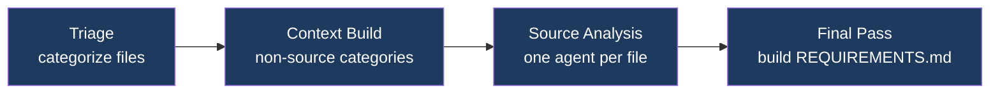
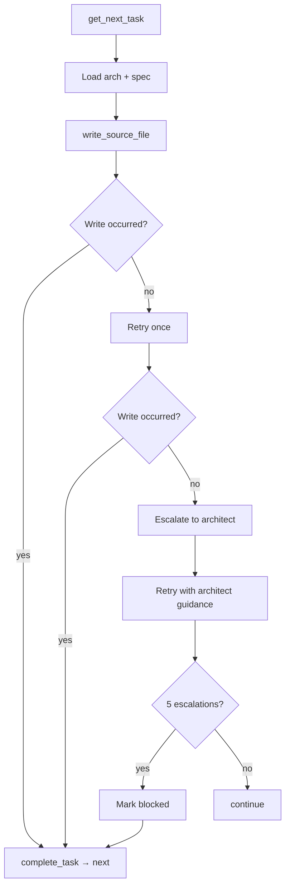

# Project VoidRift

**Agentic Software Engineering Framework**

An agentic software engineering framework composed of independent framework commands — Gather, Plan, Develop, Automate, Verify — each of which reads and writes artifacts in a project's `.voidrift/` directory. AI agents reverse-engineer requirements from existing codebases, generate architecture and task breakdowns, implement code, produce infrastructure-as-code, and validate the result against acceptance criteria. Any model can fill any role: local vLLM, cloud API, or gateway.


See [ARCHITECTURE.md](ARCHITECTURE.md) for component design, data flows, and key decisions.

---

## Contents

1. [Installation](#installation)
2. [Configuration](#configuration)
3. [Models](#models)
4. [Framework Commands](#framework-commands)
5. [Utility Commands](#utility-commands)
6. [Worker Node](#worker-node)
7. [Project Layout](#project-layout)
8. [Tried Local Models](#tried-local-models)
9. [Development](#development)

---

## Installation

**Workstation requirements:** Linux, macOS, or WSL2 · Git

```bash
git clone <repo-url> ~/Projects/voidrift
cd ~/Projects/voidrift
make setup        # installs packages and syncs resources to ~/.voidrift/
```

Verify:

```bash
voidrift          # opens interactive mode if no args
```

---

## Configuration
## Configuration

All settings in `~/.voidrift/config.yml`:

```yaml
models_file: ~/.worker-cli/models.yml

api_keys:
  anthropic: ${ANTHROPIC_API_KEY}
  gemini: ${GEMINI_API_KEY}
```

The `models_file` points to the model registry maintained by the [worker-cli](https://github.com/your-org/worker-cli) project. All model definitions — local, cloud, and gateway — live in that single file.

Config values support variable expansion:

| Syntax | Meaning |
|---|---|
| `${VAR}` | Environment variable |
| `${VAR:-default}` | Environment variable with fallback |
| `${section.key}` | Cross-reference within config.yml |

---

## Models

Models are referenced by alias in all commands. All model definitions — local, cloud, and gateway — live in a single models file maintained by the [worker-cli](https://github.com/your-org/worker-cli) project. Each entry is self-contained with its own connection details.

See [Appendix C](#appendix-c-model-registry) for the full model table, or run `voidrift` with no arguments to see available models.

---

## Framework Commands

Each command writes artifacts to `<project>/.voidrift/`. Run commands from your project directory.

### Gather

Reverse-engineers requirements from an existing codebase in four stages:



```bash
voidrift gather <model> <path>             # update REQUIREMENTS.md if it exists; create if not
voidrift gather <model> <path> --overwrite # remove previous gather artifacts and start fresh
```

Produces: `REQUIREMENTS.md`, `ANALYSIS.md` (index), `analysis/<file>.md` (per-file), `spec/<module>.md`

Re-running gather updates requirements in place: the existing `REQUIREMENTS.md` is passed as context to the final consolidation pass, which merges new analysis with preserved rationale and user stories. Gather never auto-commits. Respects `.gitignore`. Use `voidrift chat <model>` to iterate on requirements interactively.

### Plan

Generates architecture and task breakdown from requirements:

```bash
voidrift plan <model>             # auto-detects: update if artifacts exist, fresh plan if not
voidrift plan <model> --overwrite # remove previous plan artifacts and start fresh
voidrift plan <model> <feature>   # scope to a specific spec file
```

Produces: `ARCHITECTURE.md`, `TASKS.md`, `arch/<module>.md`

Re-running plan automatically detects existing artifacts and switches to update mode: plan reads current source files to determine what is already implemented, then writes a fresh task list covering only what remains. Tasks that no longer apply are removed; new tasks are added for unaddressed requirements. `ARCHITECTURE.md` is a lean system map (module inventory, cross-module contracts). `arch/<module>.md` carries the design depth for each module (components, data models, interfaces). Tasks are single atomic file operations with enough context for an agent to implement without cross-referencing requirements.

### Develop

Executes tasks one at a time. Each task gets a fresh agent with its module's architecture and spec pre-loaded.

```bash
voidrift develop <model>                  # single model for tasks and escalation
voidrift develop <model> <architect>      # separate model for escalation
```



Multi-module projects run modules concurrently. Concurrency is automatic: local models run 1 module at a time, cloud/gateway models run up to 8 concurrently.

### Automate

Generates infrastructure-as-code from `REQUIREMENTS.md` and `ARCHITECTURE.md`:

```bash
voidrift automate <model>
voidrift automate <model> <architect>
```

Produces IaC files in the project. Reconciles gaps if IaC already exists. No hardcoded secrets — all sensitive values parameterized.

### Verify

Two-stage requirements-driven acceptance testing:

```bash
voidrift verify <model>
```

**Stage 1 — Plan agent:** Reads all project documentation (REQUIREMENTS.md, ARCHITECTURE.md, TASKS.md, spec files) and writes `.voidrift/VERIFY-PLAN.md` — one self-contained test case per testable requirement. Each test case embeds the requirement, scenario steps, credentials, and evidence collection instructions.

**Stage 2 — Concurrent sub-agents:** One sub-agent per test case. Each executes its scenario using HTTP, process, and browser tools. On failure it writes a full bug report to `.voidrift/bugs/<ITEM-ID>.md` with request/response detail, process output, stack traces, and screenshots.

**Stage 3 — Report:** Orchestrator writes `.voidrift/VERIFY.md` (summary table, per-item results with bug report links, verdict) and a STATE.md entry.

Verify never modifies source files. Failures become tasks for Develop.

---

## Utility Commands

### Interactive Mode

```bash
voidrift
```

Launched with no arguments — prompts for command, model, and options. Defaults the model to the active local model (from `~/.voidrift/.active-container`) or the first configured alias.

### Chat

```bash
voidrift chat <model>
voidrift chat <model> --doc REQUIREMENTS.md    # scope to a .voidrift/ artifact
voidrift chat <model> --doc new-feature.md     # create a new artifact
```

Interactive session with full tool access. Use to iterate on any `.voidrift/` artifact before or after a framework command. Type `/compact` to summarize conversation history when context fills up.

### Status

```bash
voidrift status
```

Shows command completion (✅ done, ⬜ not started, 🔄 in progress) and task counts.

### Log

```bash
voidrift log <command>          # show last 200 lines of most recent log
voidrift log <command> -f       # follow live output
voidrift log <command> --prune  # delete all logs for that command
voidrift log --prune            # delete all command logs
```

Command logs are at `<project>/.voidrift/logs/<command>-<timestamp>.log`. The framework system log (`voidrift.log`) is at `~/.voidrift/logs/` and rotates automatically.

### Prune

```bash
voidrift prune                # remove old project logs (keeps 5 most recent)
voidrift prune --all          # remove entire .voidrift/ directory
voidrift prune --global       # prune old global framework logs from ~/.voidrift/logs/
voidrift prune --global --all # remove all global framework logs
```

### Unlock

```bash
voidrift unlock
```

Removes `.develop.lock` and kills the running develop process. Use if a develop session exited uncleanly.

### Shell Completions

```bash
voidrift completions bash > ~/.local/share/bash-completion/completions/voidrift
```

Model alias arguments complete from configured aliases in the models file.

---

## Worker Node

The worker node is a GPU server running local LLM containers over vLLM. Worker node management — container lifecycle, model downloads, image sources, Kiro Gateway — is handled by the [worker-cli](https://github.com/your-org/worker-cli) project. VoidRift reads the model registry published by worker-cli at the path configured in `models_file` (default `~/.worker-cli/models.yml`).

Cloud-only mode requires no worker node or worker-cli installation.

---

## Project Layout

After running framework commands, your project will have:

```
your-project/
├── .voidrift/
│   ├── REQUIREMENTS.md      # System-level requirements         ← Gather
│   ├── ANALYSIS.md          # Analysis index (categories, links) ← Gather
│   ├── analysis/<file>.md   # Per-file source analysis          ← Gather
│   ├── spec/<module>.md     # Per-module requirements           ← Gather
│   ├── ARCHITECTURE.md      # System map, cross-module contracts ← Plan
│   ├── arch/<module>.md     # Module design, components, interfaces ← Plan
│   ├── TASKS.md             # Pending and blocked tasks         ← Plan
│   ├── TASKS-DONE.md        # Completed task log (append-only)  ← Develop
│   ├── VERIFY.md            # Test results, verdict             ← Verify
│   ├── STATE.md             # Command run history (append-only)
│   └── logs/
│       └── <command>-<ts>.log # Full agent dialog per run
└── src/                     # Your source code                  ← Develop

~/.voidrift/                  # Framework data (shared across projects)
├── config.yml
└── logs/
    └── voidrift.log         # CLI invocations, command outcomes (rotating)
```

---

## Tried Local Models

All benchmarks: ASUS Ascent GX10, 100 req @ 1 req/s (ShareGPT). Run your own: `worker bench 100 1`.

Benchmark table standard — columns:
- **Model:** alias · [HF repo link](url) · date benchmarked
- **vLLM Settings:** image tag · gpu_util · max_model_len · key args
- **Results:** throughput · TTFT (mean/median/P99) · TPOT · model GiB · KV cache GiB · startup
- **Summary:** verdict, retirement reason if applicable

### Active

| Model | vLLM Settings | Results | Summary |
|---|---|---|---|
| **`qwen35`**<br>[Qwen3.5-35B-A3B-FP8](https://huggingface.co/Qwen/Qwen3.5-35B-A3B-FP8)<br>*Mar 2026* | scitrera 0.17.0-t5<br>gpu_util: 0.90<br>max_len: 262144<br>prefix-caching, qwen3_xml, flashinfer | 155 tok/s<br>TTFT: 337ms / 345ms / 528ms P99<br>TPOT: 86ms / 89ms / 126ms P99 | General-purpose. 35B MoE, 3B active. Solid throughput, tight P99. Current default. |
| **`qwen35-nvfp4`**<br>[Qwen3.5-35B-A3B-NVFP4](https://huggingface.co/Sehyo/Qwen3.5-35B-A3B-NVFP4)<br>*TBD* | eugr image<br>gpu_util: 0.90<br>max_len: 262144<br>qwen3_xml parser, flashinfer | TBD | Blackwell-native FP4 (~20 GiB). Candidate for lowest-latency interactive use. |
| **`qwen35-perf`**<br>[Qwen3.5-122B-A10B-FP8](https://huggingface.co/Qwen/Qwen3.5-122B-A10B-FP8)<br>*TBD* | scitrera 0.17.0-t5<br>gpu_util: 0.90<br>max_len: 65536<br>qwen3_xml parser, flashinfer | TBD | 122B MoE, 10B active. High-capability tier. |
| **`glm47`**<br>[GLM-4.7-Flash-FP8-Dynamic](https://huggingface.co/unsloth/GLM-4.7-Flash-FP8-Dynamic)<br>*TBD* | scitrera 0.17.0-t4<br>gpu_util: 0.85<br>max_len: 131072<br>glm47 parser, flashinfer | TBD | MoE Flash, 128K context, GX10 optimized. |

### Tried

| Model | vLLM Settings | Results | Summary |
|---|---|---|---|
| **`qwen3-coder`**<br>[Qwen3-Coder-30B-A3B-Instruct-FP8](https://huggingface.co/Qwen/Qwen3-Coder-30B-A3B-Instruct-FP8)<br>*Feb 2026* | scitrera 0.17.0-t5<br>gpu_util: 0.90<br>max_len: 65536<br>qwen3_coder parser, flashinfer | 152 tok/s<br>TTFT: 273ms / 249ms / 887ms P99<br>TPOT: 82ms / 84ms median<br>Model: 29 GiB · KV: 76 GiB (~900k tok)<br>Startup: ~4.5 min | Code-focused develop model. Replaced by Qwen3.5 series (Mar 2026). |
| **`qwen3-instruct`**<br>[Qwen3-30B-A3B-Instruct-2507-FP8](https://huggingface.co/Qwen/Qwen3-30B-A3B-Instruct-2507-FP8)<br>*Feb 2026* | scitrera 0.17.0-t5<br>gpu_util: 0.90<br>max_len: 65536<br>qwen3_xml parser, flashinfer | 158 tok/s<br>TTFT: 318ms / 253ms / 2279ms P99<br>TPOT: 83ms / 86ms median<br>Model: 29 GiB · KV: 76 GiB (~830k tok)<br>Startup: ~4 min | General-purpose gather/plan model. Replaced by Qwen3.5 series (Mar 2026). |
| **`qwen3-8b`**<br>[Qwen3-8B-FP8](https://huggingface.co/Qwen/Qwen3-8B-FP8)<br>*Feb 2026* | scitrera 0.17.0-t5<br>gpu_util: 0.95<br>max_len: 40960<br>qwen3_xml parser, flashinfer | 176 tok/s<br>TTFT: 307ms / 149ms / 3288ms P99<br>TPOT: 44ms / 44ms median<br>Model: ~8 GiB · KV: ~97 GiB (~2.4M tok)<br>Startup: ~2.5 min | Fastest in Qwen3 series. Dense 8B, large KV pool. Replaced by Qwen3.5 series (Mar 2026). |
| **`qwen3-coder-next`**<br>[Qwen3-Coder-Next-FP8-dynamic](https://huggingface.co/RedHatAI/Qwen3-Coder-Next-FP8-dynamic)<br>*Feb 2026* | scitrera 0.17.0-t5<br>gpu_util: 0.90<br>max_len: 65536<br>qwen3_coder parser, flashinfer | 124 tok/s<br>TTFT: 1070ms / 634ms / 5385ms P99<br>TPOT: 166ms / 171ms median<br>Model: 76 GiB · KV: 29 GiB (~318k tok)<br>Startup: ~9.5 min | 80B MoE. High latency vs. qwen3-coder — most tokens on weights, not context. Replaced by Qwen3.5 series (Mar 2026). |
| **`qwen3-32b-dense`**<br>[Qwen3-32B-FP8](https://huggingface.co/Qwen/Qwen3-32B-FP8)<br>*Feb 2026* | scitrera 0.17.0-t5<br>gpu_util: 0.90<br>max_len: 40960<br>qwen3_coder parser, flashinfer | 102 tok/s<br>TTFT: 562ms / 508ms / 2194ms P99<br>TPOT: 183ms / 183ms median<br>— | Dense 32B is 33% slower than MoE 30B-A3B at the same parameter count. Blackwell favors MoE — 3B active params per token vs. all 32B. No use case justifies the penalty. |
| **`granite-4-small`**<br>[granite-4.0-h-small-FP8](https://huggingface.co/ibm-granite/granite-4.0-h-small-FP8)<br>*Feb 2026* | scitrera 0.17.0-t5<br>gpu_util: 0.95<br>max_len: 65536<br>granite parser, flashinfer | Unacceptable latency<br>— | MoE + Mamba-2 hybrid (32B / ~9B active). Strong benchmarks but Mamba-2 SSM kernels not optimized for SM_121 in current vLLM. Worth revisiting when Mamba support for GB10 matures. |

---

## Development

```bash
make setup      # install packages + sync resources to ~/.voidrift/
make install    # install CLI package (editable)
make sync       # sync resources/ to ~/.voidrift/
make test       # run all tests
make build      # build distribution packages
```

### Repository Layout

```
voidrift/
├── cli/                          # VoidRift CLI
│   └── src/voidrift_cli/
│       ├── main.py               # Click commands, entry point
│       ├── agent.py              # Agent loop: API calls, tool dispatch, retry, streaming
│       ├── models.py             # Model alias resolution (models.yml)
│       ├── tools/                # Local agent tools: filesystem, process, HTTP, browser
│       ├── utils.py              # Utilities: STATE.md, system log, task helpers
│       ├── config.py             # Config loading, variable expansion
│       └── commands/             # command implementations: gather, plan, develop, automate, verify
├── resources/                    # Framework guidance → ~/.voidrift/resources/
│   ├── prompts/                  # system.md + per-command prompts (5 files)
│   ├── skills/                   # Domain methodology (16 files)
│   └── templates/                # Document scaffolding (4 files)
├── config.yml                    # Default config synced to ~/.voidrift/ by make sync
├── spinner-labels.txt            # Spinner labels (user-editable, not overwritten on sync)
├── REQUIREMENTS.md               # IEEE 29148 / EARS requirements
├── ARCHITECTURE.md               # Component design, data flows, design decisions
├── CHANGELOG.md
├── VERSION                       # 0.1.0
└── Makefile
```
