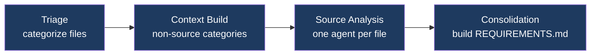
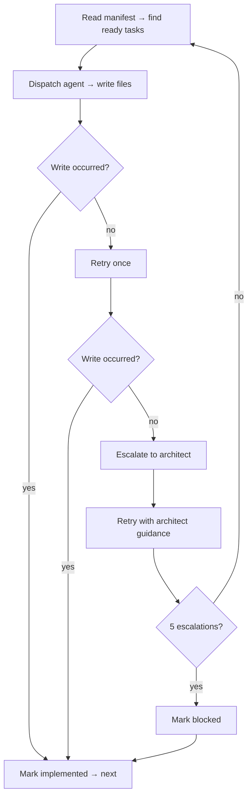

# VoidRift

**Agentic Software Engineering Framework**

AI agents reverse-engineer requirements from existing codebases, generate architecture and task breakdowns, implement code, and validate the result against acceptance criteria. Each command reads a file and writes a file — run the ones you need, skip the ones you don't, hand-author any artifact yourself. Any model can fill any role: local vLLM, cloud API, or gateway.

```
  Gather ─── reads codebase, writes REQUIREMENTS.md
  Plan ───── reads REQUIREMENTS.md, writes ARCHITECTURE.md + task tickets
  Develop ── reads task tickets, writes source code
  Verify ─── reads REQUIREMENTS.md, tests the implementation
  Deploy ─── reads verified tasks + history.log, tags release
  Chat ───── interactive refinement of any .voidrift/ artifact
```

See [ARCHITECTURE.md](ARCHITECTURE.md) for component design, data flows, and key decisions.

---

## Contents

1. [Installation](#installation)
2. [Configuration](#configuration)
3. [Models](#models)
4. [Chat](#chat)
5. [Lifecycle Commands](#lifecycle-commands)
6. [Utilities](#utilities)
7. [Project Layout](#project-layout)
8. [Development](#development)

---

## Installation

**Requirements:** Linux, macOS, or WSL2 · Git · Node.js 22+ or Bun

```bash
git clone <repo-url> ~/Projects/voidrift
cd ~/Projects/voidrift
bun install
```

Verify:

```bash
bun run dev       # run from source
voidrift          # opens chat
```

Override the default data directory (`~/.voidrift/`) by setting `VOIDRIFT_HOME`:

```bash
export VOIDRIFT_HOME=/path/to/custom/home
```

---

## Configuration

All settings live in `~/.voidrift/config.yml` (or `$VOIDRIFT_HOME/config.yml`).

```yaml
models_file: ~/models.yml
current_model: claude                # set by /model in chat; used on next launch

protected_paths:              # files blocked from agent writes
  - .env
  - .secrets
  - "**/*.pem"
  - "**/*.key"

allowed_commands:             # shell commands that skip security classification
  - "make *"
  - "pytest *"
  - "cargo *"

ssrf_allow_list: []           # hostnames/CIDRs that bypass SSRF blocking

git:
  max_diff_lines: 2000
  max_diff_files: 50
  max_file_diff_lines: 400

retention:
  project: 5                  # recent project logs to keep
  global: 30                  # days of global framework logs

cache:
  max_entries: 500
  ttl_days: 30

skills:
  synthesis_model: ""          # model alias for skill synthesis; empty disables
  repos: []                    # skill manifest URLs for search

stage_max_tokens:
  gather.triage: 8192
  gather.analysis: 8192
  gather.consolidation: 32768
  plan.architecture: 32768
  plan.module-arch: 32768
  plan.outline: 8192
  plan.deps: 8192
  plan.task: 16384
  plan.readme: 32768
  develop.task: 16384
  develop.escalation: 16384
  verify.plan: 32768
  verify.execute: 8192
  chat.session: 16384
  chat.quick: 2048
  deploy.version: 4096
  deploy.iac: 8192

bash:
  timeout: 120
  max_output_lines: 500
  develop:
    enabled: true
    allowed_patterns:
      - "make *"
      - "pytest *"
      - "cargo *"
      - "npm *"
      - "ruff *"
      - "mypy *"
      - "pyright *"
    timeout: 60
  chat:
    enabled: true
    allowed_patterns: []       # empty = use global allowed_commands
    timeout: 120
  verify:
    enabled: true
    allowed_patterns: []
    timeout: 120
```

**Config reference:**

| Key | Default | Purpose |
|---|---|---|
| `models_file` | `~/models.yml` | Path to the models YAML file |
| `current_model` | — | Last selected model alias (set by `/model` in chat) |
| `protected_paths` | `[]` | Files the agent cannot write to, even inside the project |
| `allowed_commands` | `[]` | Shell command globs that bypass security classification |
| `ssrf_allow_list` | `[]` | Hostnames/CIDRs that bypass SSRF blocking. Private IPs and cloud metadata (169.254.x) are blocked by default; loopback (127.0.0.1) is allowed |
| `git.max_diff_lines` | `2000` | Max total lines in git diff injected into agent context |
| `git.max_diff_files` | `50` | Max files in git diff |
| `git.max_file_diff_lines` | `400` | Max diff lines per file |
| `retention.project` | `5` | Number of recent project logs to keep |
| `retention.global` | `30` | Days of global framework logs to keep |
| `cache.max_entries` | `500` | Max analysis cache entries before LRU eviction |
| `cache.ttl_days` | `30` | Analysis entries older than this are pruned |
| `stage_max_tokens.<stage>` | varies | Max output tokens per agent stage, capped by the model's `max_tokens`. Stages use dotted names: `gather.triage`, `gather.analysis`, `gather.consolidation`, `plan.architecture`, `plan.module-arch`, `plan.outline`, `plan.deps`, `plan.task`, `plan.readme`, `develop.task`, `develop.escalation`, `verify.plan`, `verify.execute`, `deploy.version`, `deploy.iac`, `chat.session`, `chat.quick`, `internal.summary` |
| `skills.synthesis_model` | `""` | Model alias for skill synthesis; empty disables it |
| `skills.repos` | `[]` | Manifest URLs searched by `voidrift skills search` |
| `governance_max_tokens` | `6144` | Max tokens for the governance layer in chat. Warns when exceeded |
| `bash.timeout` | `120` | Default shell timeout (seconds) |
| `bash.max_output_lines` | `500` | Truncate shell output beyond this |
| `bash.<command>.enabled` | `true` | Enable/disable shell for a specific command |
| `bash.<command>.allowed_patterns` | `[]` | Shell command globs for this command. Empty = use global `allowed_commands`. Can only narrow, never widen the global list |
| `bash.<command>.timeout` | inherits | Per-command timeout override |

Config values support variable expansion:

| Syntax | Meaning |
|---|---|
| `${VAR}` | Environment variable |
| `${VAR:-default}` | Environment variable with fallback |
| `${section.key}` | Cross-reference within config.yml |

---

## Models

Models are referenced by alias everywhere. All definitions live in a single YAML file at the path set in `models_file`.

```yaml
# Example: ~/models.yml
defaults:
  max_tokens: 16384
  concurrency: 1

models:
  qwen35:
    base_url: http://localhost:8000/v1
    api_key: ${OPENAI_API_KEY:-no-key}
    model_id: Qwen/Qwen3.5-35B-A3B-FP8
    concurrency: 4

  claude:
    base_url: https://api.anthropic.com
    api_key: ${ANTHROPIC_API_KEY}
    model_id: claude-opus-4-6
    protocol: anthropic
    fallback: haiku
```

Each model needs `base_url`, `api_key`, and `model_id`. Optional fields:

| Field | Default | Purpose |
|---|---|---|
| `max_tokens` | `16384` | Max output tokens per API call |
| `max_context` | query API | Context window size in tokens |
| `max_read_lines` | `2000` | Max lines returned by file reads |
| `max_input_chars` | unlimited | Max input chars for gather chunking |
| `concurrency` | `1` | Max concurrent task agents in develop |
| `protocol` | `openai` | Wire protocol: `openai` or `anthropic` |
| `fallback` | — | Alias to use when retries are exhausted on 429/5xx (max one level) |
| `max_input_tokens` | — | Token budget: cap total input tokens per command run |
| `max_output_tokens` | — | Token budget: cap total output tokens per command run |

**List configured models:**

```bash
voidrift models
```

**Token budgets:** Set `max_input_tokens` and `max_output_tokens` per model to cap cost. CLI flags (`--max-input-tokens`, `--max-output-tokens` on gather and develop) override per run.

**Skills `allowed_tools`:** Skill files can include `allowed_tools: [tool1, tool2]` in YAML frontmatter to restrict which tools the agent can use while that skill is active.

---

## Chat

```bash
voidrift                                       # open chat (default)
voidrift --doc REQUIREMENTS.md                 # scope to a .voidrift/ artifact
voidrift --bare                                # no skills, git, or project state
voidrift --bare --system-prompt prompt.md      # fully custom system prompt
```

Chat is the primary interface. It opens by default when you run `voidrift` with no arguments. The agent can read and write files, run shell commands, fetch URLs, search conversation history, and persist knowledge across sessions. The active model is resolved from config — switch it mid-session with `/model`.

### Modes

Modes change the agent's personality without leaving the session or losing conversation history. Type a mode command and the agent shifts focus.

**`/chat`** — Interactive assistant (default). Helps you review, refine, and debug `.voidrift/` artifacts. Reads files before answering, proposes changes before writing, summarizes what it did. Cannot run lifecycle commands — it tells you the CLI command to run instead.

**`/gather`** — Requirements agent. Guides you toward formal, structured requirements using EARS notation (`WHEN [trigger], THE SYSTEM SHALL [result]`). Challenges vague statements, pushes for testable acceptance criteria, organizes by functional area. When you're satisfied, it writes `REQUIREMENTS.md`.

**`/plan`** — Architecture & planning agent. Helps you design systems: module boundaries, cross-module contracts, data flows, trade-offs. References REQ IDs when discussing components. Pushes for specific interfaces and error handling rather than hand-wavy descriptions.

**`/idea`** — Guided idea refinement. Walks you through four stages:
1. **Intake** — describe the idea at a high level
2. **Exploration** — clarifying questions, referencing existing requirements and architecture
3. **Shaping** — proposes a user story, acceptance criteria, and affected modules
4. **Summary** — presents the complete structured idea for your review

Type `/idea` to start a new idea or `/idea 3` to resume an existing one. Type `/done` when finished — you'll pick a priority (`now`, `next`, or `later`) and the idea is saved to `.voidrift/ideas/`.

**`/bare`** — Raw model access. Strips all automatic context: no skills, no git snapshot, no memory, no project state. Your current conversation is frozen and restored when you type any mode command (`/chat`, `/plan`, `/gather`, `/idea`) to return.

### Running Pipelines from Chat

Type `/exec` to run lifecycle commands without leaving chat. Progress appears as system messages and doesn't consume your conversation context.

```
/exec gather --import ./src       reverse-engineer requirements
/exec gather --idea 3             requirements from a refined idea
/exec plan                        generate architecture + tasks
/exec plan overwrite              fresh plan, discard previous
/exec develop                     execute tasks from manifest
/exec verify                      run acceptance tests
/exec deploy                      prepare release
```

Shorthand: `/gather --import ./src` and `/plan overwrite` route to the pipeline automatically. `/gather` and `/plan` with no arguments switch modes instead. `/develop`, `/verify`, and `/deploy` always run the pipeline.

### Session

**Persistence:** Sessions save automatically to `.voidrift/chat-session.jsonl` and restore on next launch. Close the terminal, come back later — your context is preserved.

**`/compact`** — When your conversation gets long, `/compact` summarizes the history to free space. The system prompt (governance layer) is never touched — only the message history is summarized. Auto-compact kicks in at 80% context utilization; a nudge appears at 70%. After compaction, recently used files and skills are automatically reloaded.

**`/ask <question>`** — One-shot side question. The answer appears inline and nothing is saved to the session history. Useful for quick lookups without polluting context.

**`/clear`** — Delete the session and start fresh.

**`/settings`** — View all config settings. `/settings set <key> <value>` to change one.

**`/model [alias]`** — Switch the active model. With no argument, opens a selector. The choice persists to config.

**`/help`** — Show the command reference.

### Agent Capabilities

The chat agent can:

- **Read and write files** in your project
- **Run shell commands** (with permission)
- **Fetch and summarize web pages** (with permission, cached per session)
- **Read PDFs, Word docs, and Excel files** — extracts text to markdown (requires `pdf-parse`, `mammoth`, or `xlsx` packages)
- **Analyze source code** — returns imports, exported symbols, and complexity for `.ts`, `.js`, `.py` files
- **Search conversation history** — finds earlier messages by keyword, even across compaction boundaries
- **Persist knowledge** — tell the agent "remember this for future sessions" and it saves to project or global memory. Memory entries are indexed on session start; full content loads on demand.

### Progress Display

While the model is working, a thinking indicator shows elapsed time and output tokens:

```
⠹ Pondering... · 3s · ↑ 48
```

When the response completes, a full stats line appears:

```
▸ 4s · ↓ 3.7k · ↑ 192 · ◔ 1% · ✓ complete
```

### Permission Prompts

Before the agent writes a file, runs a shell command, or reads outside the project directory, it asks:

```
▸ Permission required: file(action="write")('REQUIREMENTS.md')
  [1] Allow once  [2] Always allow this session  [3] Deny
```

Three categories are gated independently: **writes**, **runs**, and **reads outside the project root**. "Always" grants that category for the rest of the session. Denial returns an error to the agent — it can try a different approach. Resets when you exit chat.

---

## Lifecycle Commands

All commands write artifacts to `<project>/.voidrift/`. Run from your project directory.

### Gather

Reverse-engineers requirements from an existing codebase.

```bash
voidrift gather --model <alias> --import <path>                    # from codebase
voidrift gather --model <alias> --idea <id>                        # from a refined idea
voidrift gather --model <alias> --ref <path>                       # open chat with codebase as context
voidrift gather --model <alias> --import <path> --overwrite        # fresh start
voidrift gather --model <alias> --import <path> --max-output-tokens 50000
```

**`--import`** runs a four-stage pipeline:



Produces: `REQUIREMENTS.md`, `ANALYSIS.md` (index), `analysis/<file>.md` (per-file). Re-running merges new analysis with existing requirements. Respects `.gitignore`. Never auto-commits.

**`--idea`** generates requirements from a refined idea file, recording affected REQ IDs and a diff back into the idea file.

**`--ref`** opens a chat session with the external codebase's file tree loaded as context — you drive the requirements conversation manually.

### Plan

Generates architecture and task breakdown from requirements.

```bash
voidrift plan --model <alias>                # update mode if artifacts exist, fresh if not
voidrift plan --model <alias> --overwrite    # remove previous plan artifacts, start fresh
```

Six stages: architecture → module arch → task outline → dependency resolution → task files → README. Produces: `ARCHITECTURE.md`, `arch/<module>.md`, `tasks/manifest.yml`, `tasks/active/TASK-*.md`, `README.md`.

Re-running with existing artifacts triggers update mode — a delta analysis identifies what's already implemented and the pipeline focuses on remaining work. `--overwrite` removes all plan artifacts for a clean slate.

### Develop

Executes tasks from the manifest.

```bash
voidrift develop --model <alias>                                   # single model
voidrift develop --model <alias> --architect <alias>               # separate model for escalation
voidrift develop --model <alias> --max-output-tokens 50000
voidrift develop --model <alias> --max-input-tokens 200000
```

Each task gets a fresh agent with the task file as its prompt. Ready tasks dispatch concurrently up to the model's `concurrency` limit. When concurrent, a live progress table shows per-task status, tokens, context %, and elapsed time.



In git repositories, each agent receives a snapshot of branch, recent commits, and uncommitted changes to avoid overwriting your work.

### Verify

Requirements-driven acceptance testing.

```bash
voidrift verify --model <alias>
```

**Stage 0 — Doc verification:** Checks README.md and ARCHITECTURE.md against source code. Mismatches produce bug reports in `.voidrift/bugs/DOC-N.md`.

**Stage 1 — Test planning:** Reads all project documentation and writes one self-contained test case per testable requirement to `VERIFY-PLAN.md`.

**Stage 2 — Test execution:** One concurrent sub-agent per test case using HTTP, process, shell, and browser (Playwright) tools. Failures produce bug reports with full evidence (request/response, stack traces, screenshots).

**Stage 3 — Report:** Writes `VERIFY.md` with summary table, per-item results, and verdict.

Verify never modifies source files. Failures become tasks for develop.

### Deploy

Prepares verified code for release.

```bash
voidrift deploy --model <alias>
voidrift deploy --model <alias> --architect <alias>
```

Determines version bump (major/minor/patch) from verified tasks since the last release tag. Generates a changelog entry from `history.log`. Creates an annotated git tag. Optionally generates infrastructure-as-code when ARCHITECTURE.md indicates infrastructure requirements.

---

## Utilities

None of these require a model.

### Status

```bash
voidrift status
```

Shows command completion (done / not started / in progress), task counts by lifecycle status, and idea count.

### Models

```bash
voidrift models
```

Lists all configured model aliases from the models file.

### Log

```bash
voidrift log                         # last 200 lines of project log
voidrift log <command>               # last 200 lines of most recent <command> section
voidrift log <command> -f            # follow live output
voidrift log --global                # global framework log
voidrift log --prune                 # delete project log
voidrift log --prune --global        # delete global framework log
```

Project log: `.voidrift/voidrift.log`. Global log: `~/.voidrift/logs/voidrift.log` (records CLI invocations with cwd, model, and outcome metadata).

### Prune

```bash
voidrift prune                       # remove old project logs (keeps 5 most recent)
voidrift prune --all                 # remove entire .voidrift/ directory
voidrift prune --global              # prune old global framework logs
voidrift prune --global --all        # remove all global framework logs
```

### Unlock

```bash
voidrift unlock
```

Removes `.develop.lock` and kills the running develop process. Use if a develop session exited uncleanly.

### Rollback

```bash
voidrift rollback                    # list available checkpoints
voidrift rollback <turn>             # restore working tree to checkpoint at turn N
```

Checkpoints are created automatically before each task during `voidrift develop`.

### Doctor

```bash
voidrift doctor                      # run diagnostic checks
voidrift doctor --fix                # auto-fix where safe (create missing directories)
```

Checks config syntax, models file, skill parseability, log directory writability, and disk space.

### Skills

```bash
voidrift skills list                 # all skills by layer (north star, domain, project)
voidrift skills search <query>       # search configured repos
voidrift skills install <name>       # synthesize and install (pending approval)
voidrift skills approve <name>       # promote pending to active
voidrift skills remove <name>        # remove a domain skill
voidrift skills review               # list pending skills
```

### Shell Completions

```bash
# bash
voidrift completions bash > ~/.local/share/bash-completion/completions/voidrift

# zsh
voidrift completions zsh > ~/.zfunc/_voidrift

# fish
voidrift completions fish > ~/.config/fish/completions/voidrift.fish
```

Model aliases complete on tab.

---

## Project Layout

After running framework commands, your project will have:

```
your-project/
├── .voidrift/
│   ├── REQUIREMENTS.md        # System-level requirements           ← Gather
│   ├── ANALYSIS.md            # Analysis index                      ← Gather
│   ├── analysis/<file>.md     # Per-file source analysis            ← Gather
│   ├── ARCHITECTURE.md        # System map, cross-module contracts  ← Plan
│   ├── arch/<module>.md       # Module design, interfaces           ← Plan
│   ├── ideas/                 # Idea backlog                        ← Chat
│   │   ├── IDEA-{id}.md
│   │   └── archived/
│   ├── tasks/                 # Work items                          ← Plan/CLI
│   │   ├── manifest.yml       # Task status, deps, modules
│   │   ├── active/            # Task and bug tickets
│   │   ├── archived/          # Verified tasks
│   │   └── history.log        # Lifecycle event log
│   ├── bugs/                  # Bug reports from verify             ← Verify
│   ├── VERIFY-PLAN.md         # Test cases                         ← Verify
│   ├── VERIFY.md              # Test results, verdict               ← Verify
│   ├── STATE.md               # Command run history (append-only)
│   ├── chat-session.jsonl     # Chat session                       ← Chat
│   ├── memory/                # Project-specific memory entries     ← Chat
│   └── voidrift.log           # Command run log                    ← All
└── src/                       # Your source code                    ← Develop

~/.voidrift/                    # Framework data (shared across projects)
├── config.yml
├── memory/                    # Global memory (operator preferences)
├── resources/                 # Skills, prompts, templates
└── logs/
    └── voidrift.log           # CLI invocations, command outcomes
```

---

## Development

```bash
bun install          # install dependencies
bun test             # run all 986 tests (vitest)
bun run build        # build CLI binary (tsup)
bun run dev          # run from source
```

CI runs on every push via `.github/workflows/ci.yml` (ubuntu-latest + macos-latest).

### Example Workflows

**New project — reverse-engineer from existing code:**

```bash
voidrift gather --model claude --import ./src    # reverse-engineer requirements
voidrift --doc REQUIREMENTS.md                   # review and refine in chat
voidrift plan --model claude                     # generate architecture + tasks
voidrift --doc ARCHITECTURE.md                   # review architecture
voidrift develop --model claude                  # implement tasks
voidrift verify --model claude                   # acceptance testing
```

**New feature on existing project:**

```bash
voidrift                                         # open chat
# type /idea to capture and refine the feature
# type /done to save it
voidrift gather --model claude --idea 3          # generate requirements from idea
voidrift plan --model claude                     # plan tasks
voidrift develop --model claude                  # implement
voidrift verify --model claude                   # validate
```
