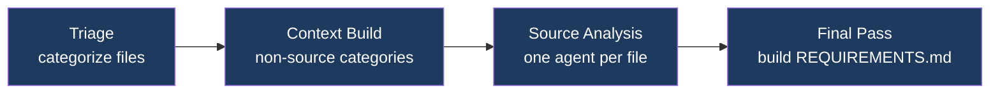
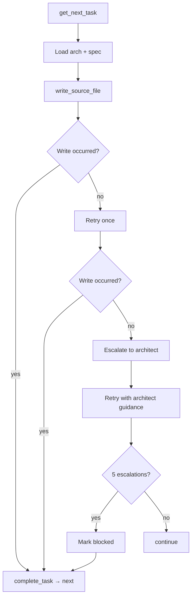

# Project VoidRift

**Agentic Software Engineering Framework**

An agentic software engineering framework composed of independent framework commands — Gather, Plan, Develop, Verify, Deploy, Chat — each of which reads and writes artifacts in a project's `.voidrift/` directory. AI agents reverse-engineer requirements from existing codebases, generate architecture and task breakdowns, implement code, produce infrastructure-as-code, and validate the result against acceptance criteria. They are not a pipeline: each command's input is a file and its output is a file. Operators run the commands they need, skip the ones they don't, and can provide hand-authored artifacts to any command that accepts them. Any model can fill any role: local vLLM, cloud API, or gateway.

```
  Gather ─── reads codebase, writes REQUIREMENTS.md
  Plan ───── reads REQUIREMENTS.md, writes ARCHITECTURE.md + task tickets
  Develop ── reads task tickets, writes source code
  Verify ─── reads REQUIREMENTS.md, tests the implementation
  Deploy ── reads REQUIREMENTS.md + ARCHITECTURE.md, writes IaC
  Chat ───── interactive refinement of any .voidrift/ artifact
```

See [ARCHITECTURE.md](ARCHITECTURE.md) for component design, data flows, and key decisions.

---

## Contents

1. [Installation](#installation)
2. [Configuration](#configuration)
3. [Models](#models)
4. [Commands](#commands)
5. [Utilities](#utilities)
6. [Project Layout](#project-layout)
7. [Development](#development)

---

## Installation

**Workstation requirements:** Linux, macOS, or WSL2 · Git

```bash
git clone <repo-url> ~/Projects/voidrift
cd ~/Projects/voidrift
make setup        # installs packages and syncs resources to ~/.voidrift/
```

Verify:

```bash
voidrift          # opens interactive mode if no args
```

---

## Configuration

All settings in `~/.voidrift/config.yml`:

```yaml
models_file: ~/.worker-cli/models.yml

api_keys:
  anthropic: ${ANTHROPIC_API_KEY}
  gemini: ${GEMINI_API_KEY}
```

The `models_file` points to a YAML file containing all model definitions — local, cloud, and gateway. The path can be anywhere on the system.

Config values support variable expansion:

| Syntax | Meaning |
|---|---|
| `${VAR}` | Environment variable |
| `${VAR:-default}` | Environment variable with fallback |
| `${section.key}` | Cross-reference within config.yml |

---

## Models

Models are referenced by alias in all commands. All model definitions — local, cloud, and gateway — live in a single YAML file at the path configured in `models_file`. Each entry is self-contained with its own connection details.

See [Appendix C](#appendix-c-model-registry) for the full model table, or run `voidrift` with no arguments to see available models.

---

## Commands

All commands write artifacts to `<project>/.voidrift/`. Run commands from your project directory.

### Chat

```bash
voidrift chat <model>
voidrift chat <model> --doc REQUIREMENTS.md    # scope to a .voidrift/ artifact
voidrift chat <model> --doc new-feature.md     # create a new artifact
```

Interactive session with full tool access — the central command for iterating on any `.voidrift/` artifact. Review requirements before running plan, refine architecture after plan, debug issues, explore ideas. Type `/compact` to summarize conversation history when context fills up.

**Idea refinement:** Type `/idea` to start a guided idea flow — the agent walks you through intake, exploration, shaping, and summary. Ideas are stored as `IDEA-{id}.md` in `tasks/active/` and categorized as `now`, `next`, or `later`. Type `/idea 3` to resume an existing idea. Type `/done` to save and return to normal chat.

**Example workflow — new project:**
```bash
voidrift gather <model> ./src         # reverse-engineer requirements
voidrift chat <model> --doc REQUIREMENTS.md  # review and refine
voidrift plan <model>                 # generate architecture + tasks
voidrift chat <model> --doc ARCHITECTURE.md  # review architecture
voidrift develop <model>              # implement tasks
voidrift verify <model>               # acceptance testing
```

**Example workflow — new feature on existing project:**
```bash
voidrift chat <model>                 # /idea to capture and refine
voidrift chat <model> --doc REQUIREMENTS.md  # update requirements
voidrift plan <model>                 # plan produces tasks for the delta
voidrift develop <model>              # implement
voidrift verify <model>               # validate
```

### Gather

Reverse-engineers requirements from an existing codebase in four stages:



```bash
voidrift gather <model> <path>             # update REQUIREMENTS.md if it exists; create if not
voidrift gather <model> <path> --overwrite # remove previous gather artifacts and start fresh
```

Produces: `REQUIREMENTS.md`, `ANALYSIS.md` (index), `analysis/<file>.md` (per-file), `spec/<module>.md`

Re-running gather updates requirements in place: the existing `REQUIREMENTS.md` is passed as context to the final consolidation pass, which merges new analysis with preserved rationale and user stories. Gather never auto-commits. Respects `.gitignore`. Use `voidrift chat <model>` to iterate on requirements interactively.

### Plan

Generates architecture and task breakdown from requirements:

```bash
voidrift plan <model>             # auto-detects: update if artifacts exist, fresh plan if not
voidrift plan <model> --overwrite # remove previous plan artifacts and start fresh
```

Produces: `ARCHITECTURE.md`, `tasks/manifest.yml`, `tasks/active/TASK-*.md`, `arch/<module>.md`

Re-running plan automatically detects existing artifacts and switches to update mode: plan reads current source files to determine what is already implemented, then writes a fresh task list covering only what remains. Tasks that no longer apply are removed; new tasks are added for unaddressed requirements. `ARCHITECTURE.md` is a lean system map (module inventory, cross-module contracts). `arch/<module>.md` carries the design depth for each module (components, data models, interfaces). Tasks are single atomic file operations with enough context for an agent to implement without cross-referencing requirements.

### Develop

Executes tasks one at a time. Each task gets a fresh agent with its module's architecture and spec pre-loaded.

```bash
voidrift develop <model>                  # single model for tasks and escalation
voidrift develop <model> <architect>      # separate model for escalation
```



Multi-module projects run modules concurrently. Concurrency is automatic: local models run 1 module at a time, cloud/gateway models run up to 8 concurrently.

### Verify

Two-stage requirements-driven acceptance testing:

```bash
voidrift verify <model>
```

**Stage 1 — Plan agent:** Reads all project documentation (REQUIREMENTS.md, ARCHITECTURE.md, TASKS.md, spec files) and writes `.voidrift/VERIFY-PLAN.md` — one self-contained test case per testable requirement. Each test case embeds the requirement, scenario steps, credentials, and evidence collection instructions.

**Stage 2 — Concurrent sub-agents:** One sub-agent per test case. Each executes its scenario using HTTP, process, and browser tools. On failure it writes a full bug report to `.voidrift/bugs/<ITEM-ID>.md` with request/response detail, process output, stack traces, and screenshots.

**Stage 3 — Report:** Orchestrator writes `.voidrift/VERIFY.md` (summary table, per-item results with bug report links, verdict) and a STATE.md entry.

Verify never modifies source files. Failures become tasks for Develop.

### Deploy

Generates infrastructure-as-code from `REQUIREMENTS.md` and `ARCHITECTURE.md`:

```bash
voidrift deploy <model>
voidrift deploy <model> <architect>
```

Produces IaC files in the project. Reconciles gaps if IaC already exists. No hardcoded secrets — all sensitive values parameterized.

---

## Utilities

### Interactive Mode

```bash
voidrift
```

Launched with no arguments — prompts for command, model, and options. Defaults to the first configured model alias.

### Status

```bash
voidrift status
```

Shows command completion (✅ done, ⬜ not started, 🔄 in progress) and task counts.

### Log

```bash
voidrift log <command>          # show last 200 lines of most recent log
voidrift log <command> -f       # follow live output
voidrift log <command> --prune  # delete all logs for that command
voidrift log --prune            # delete all command logs
```

Command logs are at `<project>/.voidrift/logs/<command>-<timestamp>.log`. The framework system log (`voidrift.log`) is at `~/.voidrift/logs/` and rotates automatically.

### Prune

```bash
voidrift prune                # remove old project logs (keeps 5 most recent)
voidrift prune --all          # remove entire .voidrift/ directory
voidrift prune --global       # prune old global framework logs from ~/.voidrift/logs/
voidrift prune --global --all # remove all global framework logs
```

### Unlock

```bash
voidrift unlock
```

Removes `.develop.lock` and kills the running develop process. Use if a develop session exited uncleanly.

### Shell Completions

```bash
voidrift completions bash > ~/.local/share/bash-completion/completions/voidrift
```

Model alias arguments complete from configured aliases in the models file.

---

## Project Layout

After running framework commands, your project will have:

```
your-project/
├── .voidrift/
│   ├── REQUIREMENTS.md      # System-level requirements         ← Gather
│   ├── ANALYSIS.md          # Analysis index (categories, links) ← Gather
│   ├── analysis/<file>.md   # Per-file source analysis          ← Gather
│   ├── spec/<module>.md     # Per-module requirements           ← Gather
│   ├── ARCHITECTURE.md      # System map, cross-module contracts ← Plan
│   ├── arch/<module>.md     # Module design, components, interfaces ← Plan
│   ├── TASKS.md             # Pending and blocked tasks         ← Plan
│   ├── tasks/
│   │   ├── manifest.yml     # Task status, deps, modules       ← CLI
│   │   ├── active/          # Task tickets in progress         ← Plan/CLI
│   │   ├── archived/        # Verified tasks                   ← CLI
│   │   └── history.log      # Lifecycle event log              ← CLI
│   ├── VERIFY.md            # Test results, verdict             ← Verify
│   ├── STATE.md             # Command run history (append-only)
│   └── logs/
│       └── <command>-<ts>.log # Full agent dialog per run
└── src/                     # Your source code                  ← Develop

~/.voidrift/                  # Framework data (shared across projects)
├── config.yml
└── logs/
    └── voidrift.log         # CLI invocations, command outcomes (rotating)
```

---

## Development

```bash
make setup      # install packages + sync resources to ~/.voidrift/
make install    # install CLI package (editable)
make sync       # sync resources/ to ~/.voidrift/
make test       # run all tests
make build      # build distribution packages
```

### Repository Layout

```
voidrift/
├── cli/                          # VoidRift CLI
│   └── src/voidrift_cli/
│       ├── main.py               # Click commands, entry point
│       ├── agent.py              # Agent loop: API calls, tool dispatch, retry, streaming
│       ├── models.py             # Model alias resolution (models.yml)
│       ├── tools/                # Local agent tools: filesystem, process, HTTP, browser
│       ├── utils.py              # Utilities: STATE.md, system log, task helpers
│       ├── config.py             # Config loading, variable expansion
│       └── commands/             # command implementations: gather, plan, develop, deploy, verify
├── resources/                    # Framework guidance → ~/.voidrift/resources/
│   ├── prompts/                  # system.md + per-command prompts (5 files)
│   ├── skills/                   # Domain methodology (16 files)
│   └── templates/                # Document scaffolding (4 files)
├── config.yml                    # Default config synced to ~/.voidrift/ by make sync
├── spinner-labels.txt            # Spinner labels (user-editable, not overwritten on sync)
├── REQUIREMENTS.md               # IEEE 29148 / EARS requirements
├── ARCHITECTURE.md               # Component design, data flows, design decisions
├── CHANGELOG.md
├── VERSION                       # 0.1.0
└── Makefile
```
