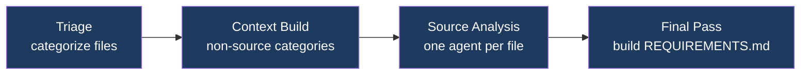
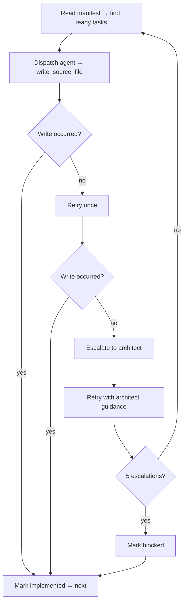

# Project VoidRift

**Agentic Software Engineering Framework**

An agentic software engineering framework composed of independent framework commands — Gather, Plan, Develop, Verify, Deploy, Chat — each of which reads and writes artifacts in a project's `.voidrift/` directory. AI agents reverse-engineer requirements from existing codebases, generate architecture and task breakdowns, implement code, produce infrastructure-as-code, and validate the result against acceptance criteria. They are not a pipeline: each command's input is a file and its output is a file. Operators run the commands they need, skip the ones they don't, and can provide hand-authored artifacts to any command that accepts them. Any model can fill any role: local vLLM, cloud API, or gateway.

```
  Gather ─── reads codebase, writes REQUIREMENTS.md
  Plan ───── reads REQUIREMENTS.md, writes ARCHITECTURE.md + task tickets
  Develop ── reads task tickets, writes source code
  Verify ─── reads REQUIREMENTS.md, tests the implementation
  Deploy ── reads verified tasks + history.log, tags release
  Chat ───── interactive refinement of any .voidrift/ artifact
```

See [ARCHITECTURE.md](ARCHITECTURE.md) for component design, data flows, and key decisions.

---

## Contents

1. [Installation](#installation)
2. [Configuration](#configuration)
3. [Models](#models)
4. [Commands](#commands)
5. [Utilities](#utilities)
6. [Project Layout](#project-layout)
7. [Development](#development)

---

## Installation

**Workstation requirements:** Linux, macOS, or WSL2 · Git

```bash
git clone <repo-url> ~/Projects/voidrift
cd ~/Projects/voidrift
make setup        # installs packages and syncs resources to ~/.voidrift/
```

Verify:

```bash
voidrift          # opens interactive mode if no args
```

---

## Configuration

All settings in `~/.voidrift/config.yml`:

```yaml
models_file: ~/.worker-cli/models.yml
active_container_file: ~/.worker-cli/.active-container

api_keys:
  anthropic: ${ANTHROPIC_API_KEY}
  gemini: ${GEMINI_API_KEY}

protected_paths:              # files blocked from agent writes
  - pyproject.toml
  - Makefile

allowed_commands:             # shell commands that skip security classification
  - "make *"
  - "pytest *"
  - "cargo *"

ssrf_allow_list:              # hostnames/CIDRs that bypass SSRF blocking
  - "internal-api.mycompany.com"
  - "10.20.30.0/24"

git:
  max_diff_lines: 2000        # max total lines in git diff output
  max_diff_files: 50          # max files included in diff
  max_file_diff_lines: 400    # max lines per file in diff

retention:
  project: 5                  # number of recent project logs to keep
  global: 30                  # days of global framework logs to keep

cache:
  max_entries: 500            # max analysis cache entries before LRU eviction
  ttl_days: 30                # analysis entries older than this are pruned

bash:
  timeout: 120                # default timeout (seconds)
  max_output_lines: 500       # truncate stdout/stderr beyond this
  develop:
    enabled: true
    allowed_patterns:          # only these patterns run in develop
      - "make *"
      - "pytest *"
      - "cargo *"
      - "npm *"
      - "ruff *"
      - "mypy *"
      - "pyright *"
    timeout: 60
  chat:
    enabled: true
    allowed_patterns: []       # empty = use global allowed_commands
    timeout: 120
  verify:
    enabled: true
    allowed_patterns: []
    timeout: 120
```

**Config reference:**

| Key | Purpose |
|---|---|
| `models_file` | Path to the models YAML file (default `~/.worker-cli/models.yml`) |
| `active_container_file` | Path to the active container marker written by worker-cli (default `~/.worker-cli/.active-container`). Used to default the model prompt in interactive mode. |
| `api_keys` | API keys for cloud providers, referenced via `${VAR}` expansion |
| `protected_paths` | Files the agent cannot write to, even inside the project root |
| `allowed_commands` | Glob patterns for shell commands that bypass security classification |
| `ssrf_allow_list` | Hostnames or CIDRs that bypass SSRF blocking on `web_fetch` and `http_request`. Private IPs (10.x, 172.16.x, 192.168.x) and cloud metadata (169.254.x) are blocked by default. Loopback (127.0.0.1) is allowed for local dev servers. |
| `git.max_diff_lines` | Cap on total git diff lines injected into agent context (default 2000) |
| `git.max_diff_files` | Cap on number of files in git diff (default 50) |
| `git.max_file_diff_lines` | Cap on diff lines per file (default 400) |
| `retention.project` | Number of recent project command logs to keep (default 5) |
| `retention.global` | Days of global framework logs to keep (default 30) |
| `cache.max_entries` | Max analysis cache entries before LRU eviction (default 500) |
| `cache.ttl_days` | Analysis entries older than this are pruned (default 30) |
| `skills.synthesis_model` | Model alias for skill synthesis via `voidrift skills install --synthesize`; empty disables synthesis (default empty) |
| `skills.repos` | List of manifest URLs searched by `voidrift skills search` (default empty) |
| `bash.timeout` | Default timeout for `run_command` across all commands (default 120s) |
| `bash.max_output_lines` | Truncate stdout/stderr beyond this many lines (default 500) |
| `bash.<command>.enabled` | Enable/disable `run_command` for a specific command (default true) |
| `bash.<command>.allowed_patterns` | Glob patterns restricting which commands the agent can run. Empty = use global `allowed_commands` |
| `bash.<command>.timeout` | Per-command timeout override (inherits from `bash.timeout`) |

The `models_file` points to a YAML file containing all model definitions — local, cloud, and gateway. The path can be anywhere on the system.

Config values support variable expansion:

| Syntax | Meaning |
|---|---|
| `${VAR}` | Environment variable |
| `${VAR:-default}` | Environment variable with fallback |
| `${section.key}` | Cross-reference within config.yml |

---

## Models

Models are referenced by alias in all commands. All model definitions — local, cloud, and gateway — live in a single YAML file at the path configured in `models_file`. Each entry is self-contained with its own connection details. An optional `fallback` field specifies another model alias to use when retries are exhausted on rate limits (429) or server errors (5xx).

```yaml
# Example: ~/.worker-cli/models.yml
defaults:
  max_tokens: 16384
  concurrency: 1

models:
  qwen35:
    base_url: http://localhost:8000/v1
    api_key: ${OPENAI_API_KEY:-no-key}
    model_id: Qwen/Qwen3.5-35B-A3B-FP8
    concurrency: 4

  claude:
    base_url: https://api.anthropic.com
    api_key: ${ANTHROPIC_API_KEY}
    model_id: anthropic/claude-opus-4-6
    provider: anthropic
    fallback: haiku
```

Each model needs `base_url`, `api_key`, and `model_id`. Optional fields control operational limits (`max_tokens`, `max_context`, `concurrency`, `max_read_lines`) and token budgets (`max_input_tokens`, `max_output_tokens`). See [ARCHITECTURE.md](ARCHITECTURE.md) for the full model entry field reference.

**Token budgets:** Set `max_input_tokens` and `max_output_tokens` per model to cap total token consumption for a command run. Useful for expensive cloud models — a develop session with 20 tasks can accumulate significant cost. CLI flags (`--max-input-tokens`, `--max-output-tokens` on gather and develop) override model config values per run. When a limit is exceeded, the run stops with a budget summary.

**Fallback:** Set `fallback: <alias>` on a model to automatically switch to another model when retries are exhausted on rate limits (429) or server errors (5xx). Max one level of fallback — if the fallback also fails, the error is raised.

**Skills `allowed_tools`:** Skill files can include `allowed_tools: [tool1, tool2]` in YAML frontmatter to restrict which tools the agent can call while that skill is active. A read-only analysis skill can block `write_source_file`. Absent field means no restriction; empty list blocks all tools.

---

## Commands

All commands write artifacts to `<project>/.voidrift/`. Run commands from your project directory.

### Chat

```bash
voidrift chat <model>
voidrift chat <model> --doc REQUIREMENTS.md    # scope to a .voidrift/ artifact
voidrift chat <model> --doc new-feature.md     # create a new artifact
voidrift chat <model> --style terse            # minimal output (verbose/terse/raw)
voidrift chat <model> --bare                   # no skills, git, or project state — just the model
voidrift chat <model> --bare --system-prompt p.md  # fully custom system prompt
```

Interactive session with full tool access — the central command for iterating on any `.voidrift/` artifact. Review requirements before running plan, refine architecture after plan, debug issues, explore ideas.

**Session persistence:** Sessions are automatically saved to `.voidrift/chat-session.jsonl` and restored on next `voidrift chat`. Close the terminal, come back later — your context is preserved. Type `/clear` to start a fresh session.

**Context management:**
- `/compact` — summarize conversation history to free context. Auto-compact triggers at 80% utilization; a nudge appears at 70%. After compaction, recently accessed files and skills are automatically restored.
- `/quick <question>` — one-shot side question that doesn't affect session history. The answer is displayed inline and nothing is saved to the session.

**History search:** The agent can search earlier conversation turns via `search_history(query, limit)` — a case-insensitive keyword search over the raw session JSONL, including entries before compaction boundaries. Returns matching entries with timestamps and roles, content capped at 2000 characters per result. Useful when specific wording or decisions from earlier in a long session were compacted away.

**Document reading:** The agent can extract text from binary documents via `read_document(path)` — supports PDF, DOCX, and XLSX. PDF text is extracted via `pymupdf`, DOCX preserves heading hierarchy as markdown, XLSX returns markdown tables per sheet. Libraries are soft dependencies — install only what you need (`pip install pymupdf`, `pip install python-docx`, `pip install openpyxl`). Also available in gather for processing non-plaintext requirements sources.

**Code analysis:** The agent can analyze source files via `code_analysis(path)` — returns structured JSON with language, line count, imports, exported symbols (functions, classes, constants with line numbers), and complexity estimate. Powered by tree-sitter — install the base package and per-language grammars (`pip install tree-sitter tree-sitter-python`). Also available in gather for supplementing prompt-based analysis with machine-parsed facts.

**Memory:** The agent can persist project knowledge across sessions using memory entries. When you say "remember this for future sessions," the agent calls `write_memory` to save it. Memory has two layers:
- Project memory (`.voidrift/memory/`) — facts specific to this project (stack, conventions, decisions)
- Global memory (`~/.voidrift/memory/`) — operator preferences shared across all projects

On session start, the memory index (names and descriptions) is injected into the system prompt. The agent loads full entries on demand via `read_memory`. Project entries override global entries with the same name.

**Idea refinement:** Type `/idea` to start a guided idea flow — the agent walks you through intake, exploration, shaping, and summary. Ideas are stored as `IDEA-{id}.md` in `.voidrift/ideas/` and categorized as `now`, `next`, or `later`. Type `/idea 3` to resume an existing idea. Type `/done` to save and return to normal chat.

**Bare mode:** `--bare` strips all automatic context injection — no skills, git snapshot, project state, or memory. Just you and the model with full session mechanics. Combine with `--system-prompt <path>` to replace the system prompt entirely.

**Output styles:** `--style verbose` (default) shows each tool call. `--style terse` hides individual calls, shows a summary count per round. `--style raw` disables Rich formatting for piping.

**Example workflow — new project:**
```bash
voidrift gather <model> --path ./src         # reverse-engineer requirements
voidrift chat <model> --doc REQUIREMENTS.md  # review and refine
voidrift plan <model>                 # generate architecture + tasks
voidrift chat <model> --doc ARCHITECTURE.md  # review architecture
voidrift develop <model>              # implement tasks
voidrift verify <model>               # acceptance testing
```

**Example workflow — new feature on existing project:**
```bash
voidrift chat <model>                        # /idea to capture and refine
voidrift gather <model> --idea 3             # generate requirements from idea
voidrift plan <model> --idea 3               # plan tasks scoped to idea
voidrift develop <model>                     # implement
voidrift verify <model>                      # validate
```

### Gather

Reverse-engineers requirements from an existing codebase in four stages:



```bash
voidrift gather <model> --path <path>        # reverse-engineer requirements from codebase
voidrift gather <model> --idea <id>          # generate requirements from a refined idea
voidrift gather <model> --path <path> --overwrite  # remove previous gather artifacts and start fresh
voidrift gather <model> --path <path> --max-output-tokens 50000  # cap total output tokens
```

Produces: `REQUIREMENTS.md`, `ANALYSIS.md` (index), `analysis/<file>.md` (per-file)

`--path` mode reverse-engineers requirements from the codebase using a four-stage pipeline. `--idea` mode reads a refined idea file and uses the same ANALYSIS-REQS skill and REQUIREMENTS-TEMPLATE to generate or update requirements — recording the affected REQ IDs and a diff in the idea file.

Re-running gather updates requirements in place: the existing `REQUIREMENTS.md` is passed as context to the final consolidation pass, which merges new analysis with preserved rationale and user stories. Gather never auto-commits. Respects `.gitignore`.

### Plan

Generates architecture and task breakdown from requirements:

```bash
voidrift plan <model>             # update mode if artifacts exist, fresh plan if not
voidrift plan <model> --idea <id> # scope planning to a specific idea (requires reqs)
voidrift plan <model> --overwrite # remove previous plan artifacts and start fresh
```

Produces: `ARCHITECTURE.md`, `README.md`, `tasks/manifest.yml`, `tasks/active/TASK-*.md`, `arch/<module>.md`

Re-running plan when artifacts already exist triggers update mode: a delta analysis agent scans the project source tree (filenames only) against REQUIREMENTS.md to identify what's already implemented. The delta summary is injected into the architecture and task outline stages so the pipeline focuses on unimplemented work. `--overwrite` removes all plan-produced directories (`tasks/`, `arch/`) and `ARCHITECTURE.md` before starting for a guaranteed clean slate with no delta analysis. `ARCHITECTURE.md` is a lean system map (module inventory, cross-module contracts). `arch/<module>.md` carries the design depth for each module (components, data models, interfaces). `README.md` is the user manual — how to install, configure, and use the project. Tasks are single atomic file operations with enough context for an agent to implement without cross-referencing requirements.

### Develop

Executes tasks from the manifest. Each task gets a fresh agent with the task file as its prompt — self-contained with user story, context, and acceptance criteria.

```bash
voidrift develop <model>                  # single model for tasks and escalation
voidrift develop <model> <architect>      # separate model for escalation
voidrift develop <model> --max-output-tokens 50000  # cap total output tokens
voidrift develop <model> --max-input-tokens 200000  # cap total input tokens
```



Ready tasks from any module are dispatched concurrently up to the model's `concurrency` limit (configured per model in models.yml). When concurrency is 1, tasks run sequentially. When concurrent, a Rich Live table shows per-task progress (status, turn, tokens, context %, elapsed, last tool). In git repositories, each agent receives a compact git context snapshot (branch, recent commits, uncommitted changes) to avoid overwriting uncommitted work or duplicating recent changes.

### Verify

Two-stage requirements-driven acceptance testing:

```bash
voidrift verify <model>
```

**Stage 1 — Plan agent:** Reads all project documentation (REQUIREMENTS.md, ARCHITECTURE.md, arch/*.md, task files) and writes `.voidrift/VERIFY-PLAN.md` — one self-contained test case per testable requirement. Each test case embeds the requirement, scenario steps, credentials, and evidence collection instructions.

**Stage 2 — Concurrent sub-agents:** One sub-agent per test case. Each executes its scenario using HTTP, process, and browser tools. On failure it writes a full bug report to `.voidrift/bugs/<ITEM-ID>.md` with request/response detail, process output, stack traces, and screenshots.

**Stage 3 — Report:** Orchestrator writes `.voidrift/VERIFY.md` (summary table, per-item results with bug report links, verdict) and a STATE.md entry.

Verify never modifies source files. Failures become tasks for Develop.

### Deploy

Prepares verified code for release:

```bash
voidrift deploy <model>
voidrift deploy <model> <architect>
```

Determines version bump (major/minor/patch) from verified tasks since the last release tag. Generates a changelog entry from history.log. Creates an annotated git tag locking the changeset. Optionally generates IaC when ARCHITECTURE.md indicates infrastructure requirements.

---

## Utilities

### Interactive Mode

```bash
voidrift
```

Launched with no arguments — prompts for command, model, and options. Defaults to the first configured model alias.

### Status

```bash
voidrift status
```

Shows command completion (✅ done, ⬜ not started, 🔄 in progress) and task counts.

### Log

```bash
voidrift log <command>          # show last 200 lines of most recent log
voidrift log <command> -f       # follow live output
voidrift log <command> --prune  # delete all logs for that command
voidrift log --prune            # delete all command logs
```

Command logs are at `<project>/.voidrift/logs/<command>-<timestamp>.log`. The framework system log (`voidrift.log`) is at `~/.voidrift/logs/` and rotates automatically.

### Prune

```bash
voidrift prune                # remove old project logs (keeps 5 most recent)
voidrift prune --all          # remove entire .voidrift/ directory
voidrift prune --global       # prune old global framework logs from ~/.voidrift/logs/
voidrift prune --global --all # remove all global framework logs
```

### Unlock

```bash
voidrift unlock
```

Removes `.develop.lock` and kills the running develop process. Use if a develop session exited uncleanly.

### Rollback

```bash
voidrift rollback          # list available checkpoints
voidrift rollback <turn>   # restore working tree to checkpoint at turn N
```

Restores the working tree to a prior develop checkpoint. Checkpoints are created automatically before each task during `voidrift develop`.

### Doctor

```bash
voidrift doctor          # run diagnostic checks
voidrift doctor --fix    # auto-fix where safe (create missing directories)
```

Checks config file syntax, models file existence, skill file parseability, log directory writability, and disk space. Reports pass/warn/fail per check with fix suggestions.

### Skills

```bash
voidrift skills list              # list all skills by layer (north star, domain, project)
voidrift skills search <query>    # search skill manifests from configured repos
voidrift skills install <name>    # synthesize and install a domain skill (pending approval)
voidrift skills approve <name>    # promote a pending skill to active
voidrift skills remove <name>     # remove a domain skill
```

### Memory

```bash
voidrift memory list              # list all entries (project + global)
voidrift memory show <name>       # print full content of an entry
voidrift memory delete <name>     # remove from project memory
voidrift memory delete <name> --global  # remove from global memory
voidrift memory export            # export all entries as a single markdown file
```

Manage memory entries without a chat session. Memory is created during chat when you tell the agent to remember something — these commands let you review and clean up entries directly.

### Shell Completions

```bash
voidrift completions bash > ~/.local/share/bash-completion/completions/voidrift
```

Model alias arguments complete from configured aliases in the models file.

---

## Project Layout

After running framework commands, your project will have:

```
your-project/
├── .voidrift/
│   ├── REQUIREMENTS.md      # System-level requirements         ← Gather
│   ├── ANALYSIS.md          # Analysis index (categories, links) ← Gather
│   ├── analysis/<file>.md   # Per-file source analysis          ← Gather
│   ├── ARCHITECTURE.md      # System map, cross-module contracts ← Plan
│   ├── arch/<module>.md     # Module design, components, interfaces ← Plan
│   ├── ideas/               # Operator-owned idea backlog       ← Chat
│   │   ├── IDEA-{id}.md
│   │   └── archived/        # Completed ideas                  ← CLI
│   ├── tasks/               # System-owned work items           ← Plan/CLI
│   │   ├── manifest.yml     # Task status, deps, modules       ← CLI
│   │   ├── active/          # Task and bug tickets             ← Plan/CLI
│   │   ├── archived/        # Verified tasks                   ← CLI
│   │   └── history.log      # Lifecycle event log              ← CLI
│   ├── VERIFY.md            # Test results, verdict             ← Verify
│   ├── STATE.md             # Command run history (append-only)
│   ├── chat-session.jsonl   # Chat session persistence (append-only) ← Chat
│   ├── memory/              # Project-specific memory entries   ← Chat
│   └── logs/
│       └── <command>-<ts>.log # Full agent dialog per run
└── src/                     # Your source code                  ← Develop

~/.voidrift/                  # Framework data (shared across projects)
├── config.yml
├── memory/                  # Global memory (operator preferences)
└── logs/
    └── voidrift.log         # CLI invocations, command outcomes (rotating)
```

---

## Development

```bash
make setup      # install packages + sync resources to ~/.voidrift/
make install    # install CLI package (editable)
make sync       # sync resources/ to ~/.voidrift/
make test       # run all tests
make build      # build distribution packages
```

### Repository Layout

```
voidrift/
├── cli/                          # VoidRift CLI
│   └── src/voidrift_cli/
│       ├── main.py               # Click commands, entry point
│       ├── agent.py              # Agent loop: API calls, tool dispatch, hooks, retry, streaming
│       ├── models.py             # Model alias resolution (models.yml)
│       ├── token_budget.py       # TokenBudget class, BudgetExhaustedError
│       ├── error_tracker.py      # Structured error accumulation and summary
│       ├── git_context.py        # Git status snapshot for agent context injection
│       ├── git_utils.py          # Git diff with safety limits
│       ├── git_checkpoint.py     # Git stash checkpoints for develop rollback
│       ├── tools/                # Local agent tools: filesystem, process, HTTP, browser, security
│       ├── utils.py              # Utilities: STATE.md, system log, task helpers
│       ├── config.py             # Config loading, variable expansion
│       ├── session.py            # Chat session persistence (JSONL)
│       ├── memory.py             # Two-layer project/global memory system
│       ├── manifest.py           # ManifestManager: task status, deps, dispatch
│       ├── skills.py             # Skill resolution (3-layer), allowed_tools
│       ├── doctor.py             # Diagnostic checks for voidrift doctor
│       ├── ui.py                 # Console output: spinners, stats, dashboard, rendering
│       ├── testing/              # Test infrastructure: FauxProvider (record/replay API fixtures)
│       └── commands/             # command implementations: gather, plan, develop, deploy, verify, skills
├── resources/                    # Framework guidance → ~/.voidrift/resources/
│   ├── prompts/                  # system.md + per-command prompts (6 files)
│   ├── skills/                   # Domain methodology (16 files)
│   └── templates/                # Document scaffolding (4 files)
├── config.yml                    # Default config synced to ~/.voidrift/ by make sync
├── spinner-labels.txt            # Spinner labels (user-editable, not overwritten on sync)
├── REQUIREMENTS.md               # IEEE 29148 / EARS requirements
├── ARCHITECTURE.md               # Component design, data flows, design decisions
├── CHANGELOG.md
├── VERSION                       # 0.1.0
└── Makefile
```
