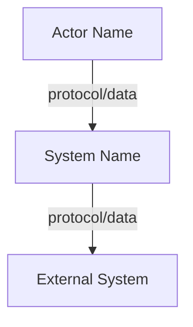
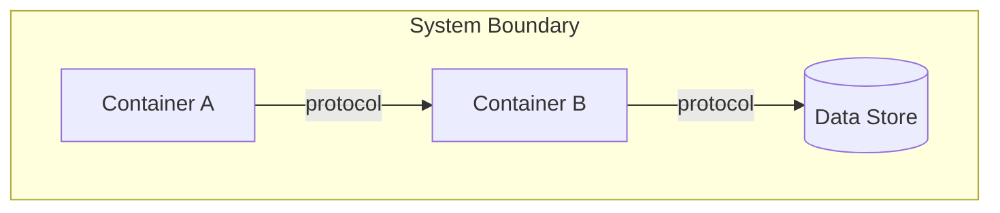
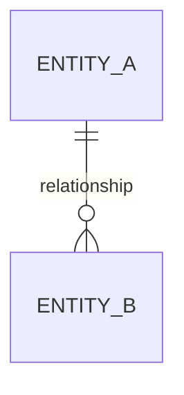

# Architecture: [Project Name]

<!-- Template follows the arc42 documentation standard (https://arc42.org) with C4 model diagrams (https://c4model.com). Populate every section with project-specific content. -->

<!-- Verify fields — required for `voidrift verify` to start and test the system -->
startup_command: <!-- Shell command to start the system (e.g. "uvicorn main:app --port 8000"). Omit or leave blank for non-runnable projects (libraries, CLIs with no server). -->
test_bootstrap: <!-- Shell command to seed test data before verify runs (e.g. "python scripts/seed_test_data.py"). Omit if no seeding is needed. -->

## 1. Introduction and Goals

State the project's purpose, primary use cases, and the key stakeholders. Keep this to one paragraph — the requirements document has the detail.

### Quality Goals

Rank the top 3–5 quality attributes by priority. Each must be measurable.

| Priority | Quality Attribute | Scenario |
|----------|------------------|----------|
| 1 | _e.g. Reliability_ | _The system recovers from a database failure within 30 seconds without data loss._ |
| 2 | _e.g. Performance_ | _API responses return within 200ms at p95 under 100 concurrent users._ |

## 2. Constraints

List all non-negotiable technical, organizational, and regulatory constraints that shape the architecture. These are inputs, not decisions.

- **Technical:** Languages, frameworks, platform requirements, minimum versions.
- **Organizational:** Team size, deadlines, budget, skill gaps.
- **Regulatory:** Compliance standards (GDPR, HIPAA, SOC2), data residency.
- **Conventions:** Coding standards, documentation rules, branching strategy.

## 3. Context and Scope

Define the system boundary — what is inside the system and what is external. Identify all actors (users, external systems, APIs) and the data exchanged at each boundary.

### System Context Diagram (C4 Level 1)

Replace the placeholder with a Mermaid diagram showing the system as a single box, all external actors, and the data/protocols flowing between them.



## 4. Components

List every major component, its responsibility, the technology it uses, and its interfaces. Every component mentioned in diagrams must appear here.

| Component | Responsibility | Technology | Interfaces |
|-----------|---------------|------------|------------|
| _e.g. API Gateway_ | _Route requests, enforce auth_ | _Express.js_ | _REST /api/v1/*_ |

## 5. Building Block View

Show the static structure — how the system decomposes into containers and components.

### Container Diagram (C4 Level 2)

Show all deployable units (services, databases, queues, frontends) and the communication between them. Label every arrow with the protocol and data format.



### Component Diagram (C4 Level 3)

For each non-trivial container, show its internal components, their responsibilities, and how they interact. Only include this level for containers with significant internal complexity.

## 6. Data Models

Document the core domain entities, their relationships, and where state lives.

### Entity Relationships

Use a Mermaid ER diagram showing entities, their key attributes, and cardinality.



### State Ownership

For each piece of persistent state, document which component owns it, the storage mechanism, and the consistency model (strong, eventual, cache).

| State | Owner | Storage | Consistency |
|-------|-------|---------|-------------|
| _e.g. User sessions_ | _Auth service_ | _Redis_ | _Eventual, 30min TTL_ |

## 7. API Surface

Document every external and internal API the system exposes or consumes.

### External APIs (exposed)

For each API: base path, authentication method, versioning strategy, rate limits, and a summary of endpoints grouped by resource.

### Internal APIs (between components)

For each inter-component interface: protocol, data format, error contract, and retry/timeout policy.

### Consumed APIs (external dependencies)

For each external API the system calls: provider, purpose, authentication, SLA, and fallback behavior if unavailable.

## 8. Configuration

Document every configuration parameter the system requires to run.

| Parameter | Source | Required | Default | Purpose |
|-----------|--------|----------|---------|---------|
| _e.g. DATABASE_URL_ | _env var_ | _yes_ | _—_ | _PostgreSQL connection string_ |

Include: environment variables, config files, feature flags, and secrets (reference only — never include actual values).

## 9. Dependencies

### Runtime Dependencies

List external libraries and services required at runtime. For each: name, version constraint, purpose, and license.

### Build/Dev Dependencies

List tools required to build, test, and develop. For each: name, version constraint, purpose.

### External Services

List third-party services the system depends on (databases, message queues, cloud services, APIs). For each: purpose, SLA expectation, and what happens if it's unavailable.

## 10. Runtime View

Show how components interact over time for the most important use cases. Use sequence diagrams for each key workflow.

```mermaid
sequenceDiagram
    %% Replace with actual workflow
    Actor->>Component A: request
    Component A->>Component B: internal call
    Component B-->>Component A: response
    Component A-->>Actor: result
```

Include at minimum: the primary happy path, one error/failure path, and any async workflows.

## 11. Deployment View

Map software components to infrastructure. Document how the system is deployed, scaled, and monitored.

- **Infrastructure:** Cloud provider, regions, compute (containers, serverless, VMs).
- **Orchestration:** Kubernetes, ECS, docker-compose, or manual.
- **IaC:** Terraform, CDK, Pulumi — reference the files.
- **Scaling:** Horizontal/vertical strategy, auto-scaling triggers.
- **Networking:** VPCs, load balancers, DNS, TLS termination.

## 12. Cross-cutting Concerns

### Security
Authentication method, authorization model, encryption (at rest, in transit), secret management, input validation strategy.

### Observability
Logging format and aggregation, metrics collection, distributed tracing (correlation IDs), alerting thresholds.

### Error Handling
Global error handling patterns, retry policies, circuit breakers, dead letter queues, user-facing error format.

## 13. Risks and Technical Debt

| Risk/Debt | Impact | Likelihood | Mitigation |
|-----------|--------|------------|------------|
| _e.g. Single database, no read replicas_ | _High — outage affects all users_ | _Medium_ | _Add read replica in Q2_ |

## 14. Glossary

Define domain-specific terms, abbreviations, and any terminology that could be ambiguous. Every term used in requirements or this document that isn't universally understood must appear here.

| Term | Definition |
|------|-----------|
| _e.g. BFF_ | _Backend for Frontend — an API layer tailored to a specific client application._ |

---

## Decision Log

Record each significant architectural decision: what was decided, what alternatives were considered, and why this option was chosen. Use the format below.

| # | Decision | Alternatives Considered | Rationale |
|---|----------|------------------------|-----------|
| 1 | _e.g. Use PostgreSQL for primary storage_ | _MySQL, DynamoDB_ | _Team expertise, JSONB support, strong consistency_ |
