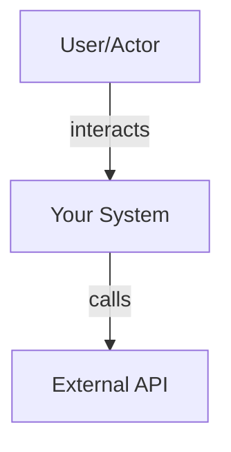
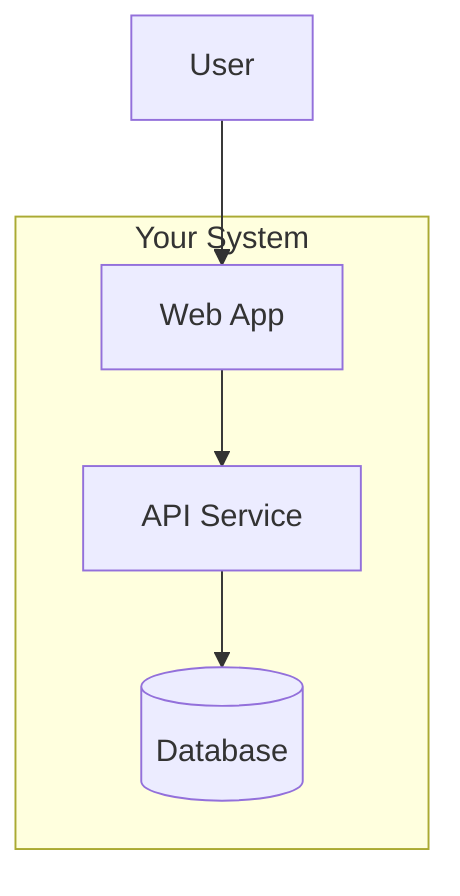
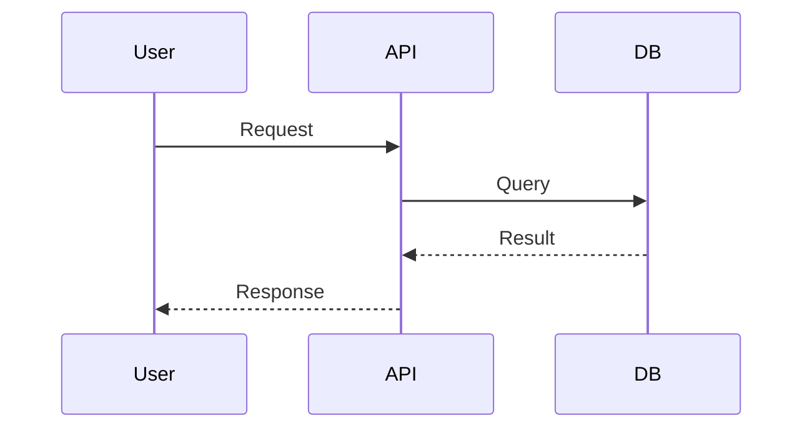

# Architecture: [Project Name]

## 1. Introduction and Goals
[Brief description of the project, its purpose, and core goals.]

### Quality Goals
- **Reliability:** [Target SLOs/SLIs]
- **Security:** [Encryption, Auth, Compliance standards]
- **Performance:** [Latency/Throughput targets]

## 2. Constraints
- **Technical:** [Languages, Frameworks, Cloud Providers]
- **Organizational:** [Deadlines, Budget, Team size]
- **Conventions:** [Coding standards, Documentation rules]

## 3. Context and Scope
[Define the boundaries of the system and its relationship with the outside world.]

### Level 1: System Context Diagram (C4)

## 4. Solution Strategy
[Summary of the fundamental architectural decisions and patterns chosen to achieve goals.]
- **Pattern:** [e.g., Hexagonal, Microservices, Layered]
- **Technology Stack:** [Primary languages and tools]

## 5. Building Block View
[The static structure of the system.]

### Level 2: Container Diagram (C4)

### Level 3: Component Diagram (C4)
[Detailed view of a single container's internal components.]

## 6. Runtime View
[How building blocks interact over time to fulfill use cases.]

## 7. Deployment View
[Mapping software to infrastructure.]
- **Cloud Provider:** [AWS/GCP/Azure]
- **Orchestration:** [K8s/ECS/Fargate]
- **IaC:** [Terraform/CDK]

## 8. Data Architecture
- **Primary Database:** [PostgreSQL/Valkey/DynamoDB]
- **Schema Strategy:** [Normalized/Document/Migrations]
- **Caching Strategy:** [Cache-Aside/TTL/Invalidation]

## 9. Cross-cutting Concepts
- **Security:** [AuthN/AuthZ/Encryption]
- **Observability:** [Logging/Metrics/Tracing]
- **Error Handling:** [Global patterns/Retries]

## 10. Risks and Technical Debt
[Known issues, security vulnerabilities, or architectural compromises.]

---

## Decision Log
[Summary of major design decisions and their rationale.]
1. [Decision: Rationale]
2. [Decision: Rationale]
