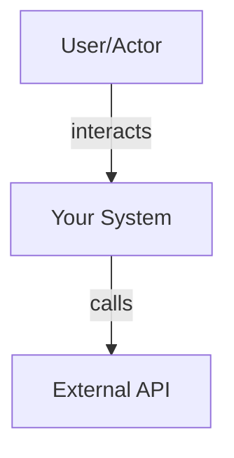
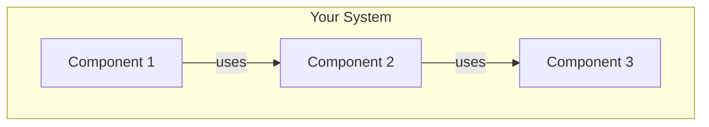
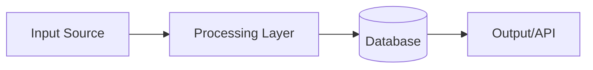
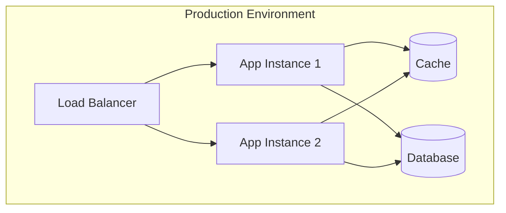
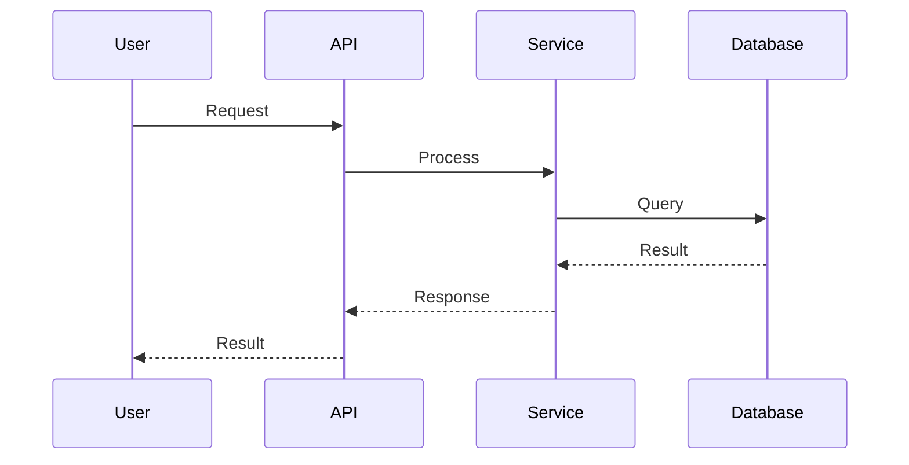

# Architecture

## Overview

[Brief project description - 1-2 paragraphs explaining what this project does, the problem it solves, and its core purpose]

[Summary of key architectural decisions]

## System Context

[High-level description of how this system fits into the broader ecosystem]

### External Dependencies
- [External system/API 1] - [purpose]
- [External system/API 2] - [purpose]

### Users/Actors
- [User type 1] - [how they interact]
- [User type 2] - [how they interact]

### System Context Diagram


## Architecture Style/Pattern

**Primary Pattern:** [e.g., Monolith, Microservices, Layered, Event-Driven, Hexagonal, etc.]

**Rationale:** [Why this pattern was chosen]

**Trade-offs:**
- [Trade-off 1]
- [Trade-off 2]

## Components/Modules

### Component Overview
[High-level description of how the system is broken down]

### Major Components

#### [Component 1 Name]
- **Responsibility:** [What this component does]
- **Key interfaces:** [APIs, contracts, or interfaces it exposes]
- **Dependencies:** [What it depends on]

#### [Component 2 Name]
- **Responsibility:** [What this component does]
- **Key interfaces:** [APIs, contracts, or interfaces it exposes]
- **Dependencies:** [What it depends on]

### Component Diagram


### Communication Patterns
[How components communicate - REST, gRPC, message queues, direct calls, etc.]

## Data Architecture

### Data Models
[Overview of key data models and entities]

### Database Strategy
- **Primary database:** [Database type and name]
- **Rationale:** [Why this database was chosen]
- **Schema approach:** [Normalized, denormalized, document-based, etc.]

### Data Flow


### Caching Strategy
[If applicable - caching layers, technologies, invalidation strategy]

### Data Persistence
[How data is persisted, backup strategy, data retention policies]

## Technology Stack

### Languages & Frameworks
- **Primary language:** [Language] - [Version]
- **Framework:** [Framework] - [Version]
- **Additional languages:** [If applicable]

### Infrastructure & Deployment
- **Cloud provider:** [AWS, GCP, Azure, on-premise, etc.]
- **Container orchestration:** [Kubernetes, ECS, Docker Compose, etc.]
- **Infrastructure as Code:** [Terraform, CloudFormation, etc.]

### Key Libraries
- [Library 1] - [Purpose and why chosen]
- [Library 2] - [Purpose and why chosen]

### Development Tools
- [Build tool]
- [Package manager]
- [Testing framework]
- [Linting/formatting tools]

## Cross-Cutting Concerns

### Authentication & Authorization
- **Authentication method:** [JWT, OAuth, session-based, etc.]
- **Authorization approach:** [RBAC, ABAC, etc.]
- **Implementation:** [How it's implemented across the system]

### Logging & Monitoring
- **Logging framework:** [Tool/library]
- **Log aggregation:** [Where logs are collected]
- **Monitoring tools:** [APM, metrics, dashboards]
- **Alerting strategy:** [When and how alerts are triggered]

### Error Handling
- **Error handling pattern:** [How errors are handled consistently]
- **Error reporting:** [How errors are tracked and reported]
- **Retry strategy:** [For transient failures]

### Security Considerations
- [Security measure 1]
- [Security measure 2]
- [Compliance requirements if applicable]

### Performance Considerations
- [Performance optimization 1]
- [Performance optimization 2]
- [Performance targets/SLAs]

### Scalability Approach
- **Horizontal scaling:** [How the system scales out]
- **Vertical scaling:** [Limitations and approach]
- **Bottlenecks:** [Known bottlenecks and mitigation]

## Deployment Architecture

### Infrastructure Components
- [Component 1] - [Purpose]
- [Component 2] - [Purpose]

### Deployment Diagram


### CI/CD Pipeline
1. [Step 1 - e.g., Code commit triggers build]
2. [Step 2 - e.g., Automated tests run]
3. [Step 3 - e.g., Deploy to staging]
4. [Step 4 - e.g., Deploy to production]

### Environment Strategy
- **Development:** [Configuration and purpose]
- **Staging:** [Configuration and purpose]
- **Production:** [Configuration and purpose]

## Development Guidelines

### Code Organization
[How code is organized - folder structure, module boundaries, naming conventions]

### Testing Strategy
- **Unit tests:** [Approach and coverage goals]
- **Integration tests:** [Approach and scope]
- **E2E tests:** [If applicable]
- **Performance tests:** [If applicable]

### Development Workflow
1. [Step 1 - e.g., Clone repository]
2. [Step 2 - e.g., Install dependencies]
3. [Step 3 - e.g., Run locally]
4. [Step 4 - e.g., Make changes and test]

### Running Locally
```bash
# Prerequisites
[List prerequisites]

# Setup
[Setup commands]

# Run
[Run commands]
```

## Known Limitations & Trade-offs

### Current Constraints
- [Constraint 1]
- [Constraint 2]

### Technical Debt
- [Technical debt item 1]
- [Technical debt item 2]

### Future Considerations
- [Future improvement 1]
- [Future improvement 2]

## Decision Log

### [Decision Title 1]
- **Date:** [YYYY-MM-DD]
- **Status:** [Accepted, Superseded, Deprecated]
- **Context:** [What prompted this decision]
- **Decision:** [What was decided]
- **Consequences:** [Impact of this decision]
- **Alternatives considered:** [Other options that were evaluated]

### [Decision Title 2]
- **Date:** [YYYY-MM-DD]
- **Status:** [Accepted, Superseded, Deprecated]
- **Context:** [What prompted this decision]
- **Decision:** [What was decided]
- **Consequences:** [Impact of this decision]
- **Alternatives considered:** [Other options that were evaluated]

## Diagrams

### System Context Diagram


### Component/Module Diagram


### Data Flow Diagram


### Deployment Diagram


### Sequence Diagrams (Critical Flows)


---

## Optional Sections

### API Architecture
[Include if the project exposes APIs]

- **API style:** [REST, GraphQL, gRPC, etc.]
- **Versioning strategy:** [How APIs are versioned]
- **Documentation:** [Where API docs are located]
- **Rate limiting:** [If applicable]

### Event/Message Architecture
[Include for event-driven systems]

- **Message broker:** [Technology used]
- **Event schema:** [How events are structured]
- **Event flow:** [How events propagate]
- **Consistency model:** [Eventual consistency approach]

### Security Architecture
[Include for security-critical systems]

- **Threat model:** [Key threats and mitigations]
- **Security controls:** [Implemented controls]
- **Compliance:** [Standards and regulations]
- **Audit logging:** [Security event logging]

### Disaster Recovery
[Include for production systems]

- **Backup strategy:** [How and when backups occur]
- **Recovery procedures:** [Steps to recover from failure]
- **RTO/RPO:** [Recovery time and point objectives]
- **Failover strategy:** [How failover works]

### Migration Strategy
[Include if replacing an existing system]

- **Migration approach:** [Big bang, phased, strangler fig, etc.]
- **Data migration:** [How data is migrated]
- **Rollback plan:** [How to revert if needed]
- **Timeline:** [Migration phases and timeline]
